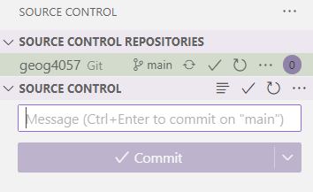
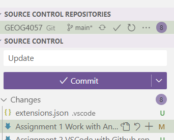
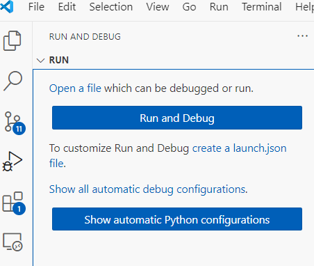

# Assignment 2 work with VS Code

## Overview

This assignment will give you the instruction to set up your assignment repository on github.com and work with git in VSCode.
Submit a report with screen captures of each step in the following instruction:

## Prerequisite

- You need to have both VS Code and git installed on your computer
- If you just installed git and did nothing, you need to run "git config" to set up the git environment
- You only need to run "git config" once
- open a command prompt and run the following code. (replace the name and email with yours)
- Use the email to create an account on github

```git
git config --global user.name "John Doe"
git config --global user.email johndoe@example.com

```

## Create a github.com repository

- Create a github.com account if you have not (use the email that you used in the git config command)
- In your github.com dashboard, click create a public repository
- Name it "geog4057_yourname"
- Open the repository and click the green "Code" button
- Check the HTTPS url
- Copy the URL to the clipboard for the next step

## Open a folder as the workspace in VS Code

- Find your Documents folder and create a new folder called "programming"
- Run VS Code
- In menu File->Open Folder
- Find the "programming" folder and open it
- The folder is empty for now. 

## Synchronize a local repository with github.com

- Press ctrl+shift+p to call the command palette
- type "git clone"
- Past the URL from Step 1 to here to clone the repository.
- If you are asked to open the clone repository in VS Code, answer "YES"
- Click trust if you see the page like below

- Now you should have a copy of the repository on your computer and opened by VS Code
- Check the Source control section in VS Code, it should look like


## Log in your github account in VS Code

- In the lower left of the Activity bar
- Click the Accounts button
- Log in with your github account there
- Once it is done, you should be able to synchronize your changes to github


## Create your first jupyter notebook and synchronize it to github.com

- Make sure you have the extension "jupyter" installed in VS Code
- Use the key combination ctrl+shift+p to call the command palette and put "new folder" and enter
- Rename the folder as "Assignment 2"
- Again, use the key combination ctrl+shift+p to call the command palette and put "create new" to find "Create New Jupyter notebook"
- The notebook will be automatically created with the name "untitled-1.ipynb"
- Turn on autosave: ctrl+shift+p -> "autosave" and enter. This will toggle the autosave option
- Manual save: Ctrl-s or in the menu->File->Save, to save the notebook to your current folder
- In the notebook, click "Kernels" and select "ArcPyClone" (the one you did in the first assignment) as the kernel
- In the first cell, try to run the following code:

```python
import arcpy
print(arcpy.GetInstallInfo()['Version'])
```

- The notebook has been saved by VS Code. It should have an "U" letter next to it in the Explorer window
- These are uncommitted changes
- Click Source Control
- Type some message in the Commit message box



- Click Commit
- Click the Sync Changes button to synchronize the changes to the server

## Create your first python script in the repository

- Use the key combination ctrl+shift+p to call the command palette and put "create new" to find "create new file"
- Rename the file to buffer.py
- Open the buffer.py
- Press shift-ctrl-p to call the command palette and type to find "python: select interpreter"
- Select "ArcPyClone" (the environment you cloned in the first assignment, which might be with a different name)
- From the geog4057/data folder, find the shapefile "no_retail" and copy it (all the files with the same name) to your "assignment 2" folder
- Put the following code in the script:

```python
import arcpy
arcpy.analysis.Buffer(
    in_features="no_retail.shp",
    out_feature_class="./retail_buffer.shp",
    buffer_distance_or_field="500 Meters",
    line_side="FULL",
    line_end_type="ROUND",
    dissolve_option="NONE",
    dissolve_field=None,
    method="PLANAR"
)
```

- Save the script file (if you have turned on the autosave option, it will be saved automatically)
  
## Run the python script with debugger

- From the activities bar, click the "Run and Debug" button

- In the dialog, click "create a launch.json file"
- Select python debugger
- Select "debug the currently active Python file"
- A new file "launch.json" will be created under your VS Code workspace root folder
- In the launch.json file, add one line to enable your current folder as the launch folder
  
```json
"cwd": "${fileDirname}",
```

- You can now close the json file and return to your "buffer.py" file
- Press the F5 button on your keyboard to start the debugger
- Wait for a while, and you should see the new shapefile is added to your current folder
- Add the buffer shapefile to an ArcGIS Pro map and capture the map into your report
  
## Run the script from a terminal

- Change the python script so that the output will use a different name from the last step

```python
import arcpy
arcpy.analysis.Buffer(
    in_features="no_retail.shp",
    out_feature_class="./retail_buffer_1.shp",
    buffer_distance_or_field="500 Meters",
    line_side="FULL",
    line_end_type="ROUND",
    dissolve_option="NONE",
    dissolve_field=None,
    method="PLANAR"
)
```

- If you do not see the terminal in VS Code, go to menu->View->Terminal to show it
- Check the current folder name
- Use the "cd" command to change the directory to your assignment 2 folder
- For example, if you are at "c:/", use "cd Users" to change the directory to "C:/users"
- Check the environment name
- If your current environment of the terminal is not ArcPyClone (or something your named when you cloned the ArcGIS environment), you "conda activate ArcPyClone" to activate it
- type "python buffer.py"
- The code should run and give you an output in the assignment 2 folder called "retail_buffer_1.shp"

## Synchronize the workspace with your github repository

- Go to the Source control button in the activities bar
- In the message bar, type "Assignment 2"
- Press Commit
- Press Sync Changes


## Submit your github repository url. The TA will check the synchronized codes in the folder: assignment 2
