# ModelBuilder with ArcGIS Pro

## Introduction

ModelBuilder is a powerful graphic designer of models that run in ArcGIS Pro defined in the Geoprocessing framework. In this tutorial, you will go through several advanced features of ModelBuilder, including iterators, collect values, and calculate value tools in a model. Three iterators will be used, including the Iterate Feature Class tool, Iterate Feature tool, and Iterate For tool.

## Data

Data can be obtained from the [data subfolder](../data) of the class repository witht the name: assignment4data.zip.

Extract the data to a workspace and add the geodatabase "ToolData" to your ArcGIS Pro project database. Also, add the folder where the data are extracted to, to the folder list of ArcGIS Pro

The database and folder look like these below:

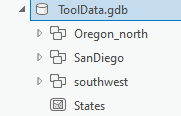) 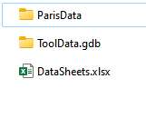

## Requirement

***For each of the following steps, screen capture your model and results for your report***

## Tutorials

### Task 1 Use the Iterate Feature Class tool (30 pnts)

The *Iterate Feature Classes* tool iterates over feature classes in a workspace or feature dataset.

#### Add tools

- Go to the Catalog pane, find the toolboxes item, and right-click it to create a new model
- Right-click the model and select properties
- Modify the name and description of the model to: 

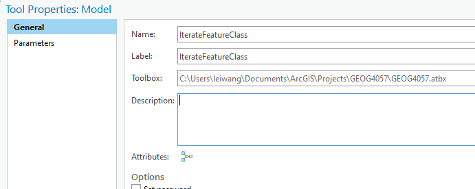

- Click the modelbuilder tab
- Click "save"
- Click Iterator and find *iterate feature class* and add it to the model
- Click Tools and find "project" and insert the project tool to the model

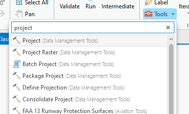

- Click "Utilities", find "Collect Values", and insert it to the model

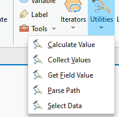

#### Change the parameters

- Specify the parameters for the Iterature Feature Class tool
  >Double-click the Iterate Feature Classes iterator to open the iterator's dialog box

  >For the Workspace or Feature Dataset parameter, browse to the Folders->ParisData
  
  >Check the Recursive check box to iterate over all the feature classes in all subfolders.
  
  >Leave the rest of the parameters empty and click OK.
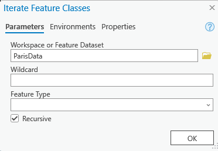

- Specify the project tool parameters

 >Click the Input Dataset or Feature Class parameter drop-down arrow and select Metro_Entrances.shp.
  
  >For the Output Dataset or Feature Class parameter, browse to the default .gdb geodatabase and type %Name%_Project.

  >Click the Coordinate System button Coordinate System on the Output Coordinate System parameter to open the Coordinate System dialog box. Select Projected Coordinate System > Continental > Europe > Europe Albers Equal Area Conic. Click OK to close the dialog box.

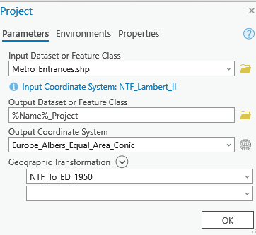

  >Hover over the Project tool output variable. Click and drag to draw a connector line to the Collect Values tool element. Release the mouse and click Input Value on the pop-up menu.

#### Refine the appearance

- Right-click the output of the Collect Values tool, and click Add To Display

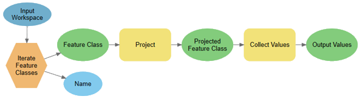

- click the Auto Layout button Auto Layout on the ModelBuilder tab, and click the Fit to Window button Fit To Window.
- Click "save" to save the model

#### Run the model

- Click the Run button Run on the ModelBuilder tab to run the model.
- Check the table of contents of your map for the new data layers added by the model 
- Check the geodatabase where the output workspace is for the new feature classes

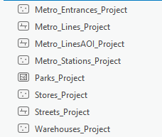

#### Reporting

- Screen capture each step of your work
- Capture the final model graph
- Capture the database with updated feature classes created from the model

---

### Task 2 Iterate Feature Selection (30 pnts)

In this workflow, you'll create a model to iterate over features grouped by regions in a feature class (USA states) and create eight feature classes, one for each group or region. The field value (region) used to split the feature class is also used as the name of the output feature class.

#### Add tools

- In your project Toolbox, create a new model and modify its name and label as "IterateFeatureSelection"

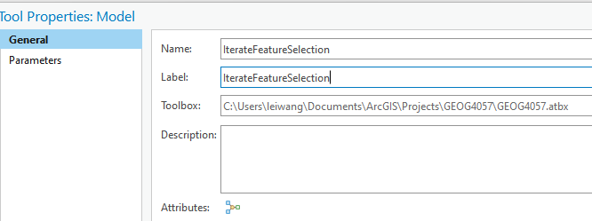

- Click the ModelBuilder tab ->Iterators and add Iterate Feature Selection tool to the model
- From Utilities, find and click "Calculate Value"
- Click in any empty place in the model, and type Copy Features and add it to the modle (You can also do the same by using the Tools button)

#### Specify the tool parameters and connect the tools

- Double-click the Iterate Feature Selection iterator to open the iterator's dialog box.
  > Click the open button and browse for the States data in the ToolData geodatabase
  Leave the rest of the parameters empty and click OK
  
  >Right-click the Feature Selection iterator and click Create Variable > From Parameter > Group By Fields 

  >Double-click the Group By Fields model variable and from the drop-down list, select Region.
  
  >Click OK to close the dialog box.
- Right-click and rename "states" to "Input Feature Class"
- Right-click and rename "I_States" to "Selected features"

- Double-click the Calculate Value tool 
  >For the Expression parameter, type "%Value%".replace(" ","") and change Data type to String. (This will remove the spaces from the region values)
 >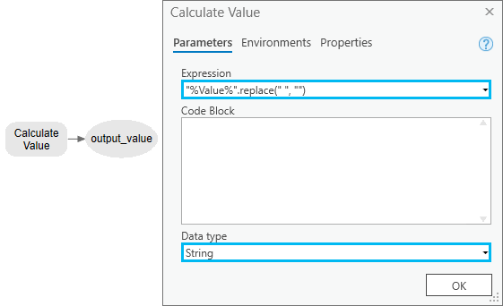
 > Click OK to close the dialog box.

- Right-click and rename the value from "Calculate Value" tool as "Name"
- Hove over the Name output from the Calculate Value tool and hold the mouse and drag the link to CopyFeatures tool. Define the link as "Precondition".
  
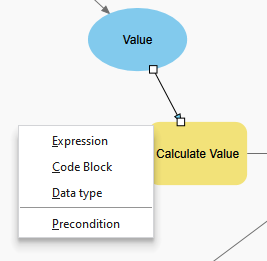

- Double-click the Copy Features tool 
  >Choose "Selected Features" from the drop-down list.
  >For the Output Feature Class parameter, browse to the project default geodatabase .gdb and type %Name%

  

  >Rename the output to "CopiedFeature"

- Add the "Collect Values tool" in the mode from the Utitlities group
  > Click and drag to draw a connector line from "CopiedFeature" to the Collect Values tool.
- Click the Auto Layout button
- The final model should look like this:
  
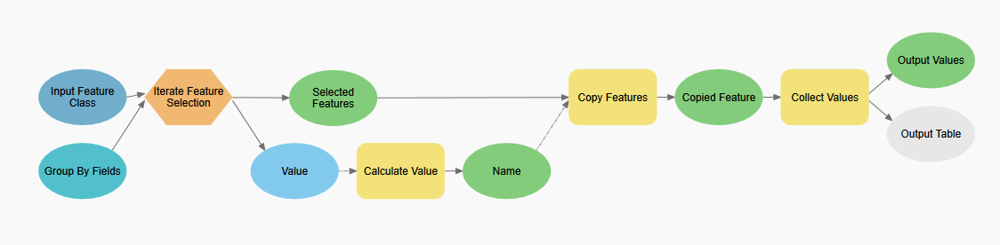

#### Run the model

- Save the model
- Click Run in the modelbuilder menu
- Refresh your database. The new feature classes should be created like these:

- Each of the feature classes was a subregion in the input feature class. 
- This concluses the task 2
#### Reporting

- Screen capture each step of your work
- Capture the final model graph
- Capture the database with updated feature classes created from the model

---

### Task 3 Iterator For tool (30 pnts)

In this workflow, you'll create a simple model that identifies the impact of proposed roads based on vegetation type and proximity to the road. In the model, the roads are first buffered three times with distance values of 500 feet, 1,000 feet, and 1,500 feet. These distance values are derived from the For iterator. The buffer zones are then used to clip the vegetation data using the Clip tool to create a dataset of vegetation types within the buffer polygons. The Summary Statistic tool then summarizes the affected area by vegetation type within the buffer polygons around the proposed roads. The Collect Values tool collects all the outputs of the iterations and adds them to the Contents pane for display in ArcGIS Pro.

#### Add tools

- Create a new model called "IteratorFor"
- From Iteratores, add iterator For Tool to the model
- In the Utilities list, click Collect Values
- In the model, click anywhere and type "Buffer" and add the Buffer Tool to the model
- Similarly, add the Clip and Summary Statistics tools to the model

#### Specify the tool parameters and connect the tools

- Specify the parameters for the For iterator
    > Double-click the For iterator to open the iterator's dialog box.
    
    >For From Value, To Value, and By Value, type 500, 1500, and 500, respectively.
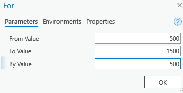    

    >Click OK to close the dialog box.

- Specify the parameters for the Buffer tool
    >Double-click the Buffer tool to open the tool's dialog box.
    
    >For the Input Features parameter, click the browse button to find SanDiego/PlanA_Roads feature layer in the ToolData geodatabase

    >For the Output Feature Class parameter, browse to the project geodatabase and type BufferedFC_%Value%

    >For the Distance [value or field] parameter, choose the Linear Unit option; leave the distance blank and set the units to Feet.

    >Hover over the For iterator output variable Value. Click and drag to draw a connector line to the Buffer tool. Release the mouse and click Distance [value or field] on the pop-up menu
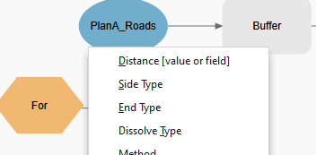

- Specify the parameters for the Clip tool
  >Double-click the Clip tool to open the tool's dialog box.
  
  >Click the browse button and find vegtype feature layer in the SanDiego dataset.

  >For the Clip Features parameter, click the drop-down arrow and select BufferedFC_%Value%.

  > For the Output Feature Class parameter, browse to the project geodatabase and type ClippedFC_%Value%.
  Click OK to close the dialog box
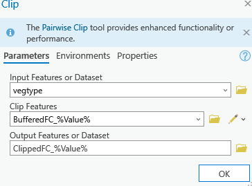

- Specify the parameters for the Summary Statistics tool
    >Double-click the Summary Statistics tool to open the tool's dialog box.

    >For the Input Table parameter, click the drop-down arrow and select ClippedFC_%Value%.
    
    >For the Output Table parameter, browse to the geodatabase and type AffectedVegetation%Value%.
    
    >For the Statistics Field(s) parameter, select Shape_area for the Field column, and Sum for the Statistic Type column.
    
    >For the Case field parameter, select VEG_TYPE.

    >Click OK to close the dialog box.

    

#### Link to the Collect Values tool and refine the outlook

- Hover over the Clip tool output variable. Click and drag to draw a connector line to the Collect Values tool. Release the mouse and click Input Value on the pop-up menu. 
- Follow the same procedure to connect the Summary Statistics tool output variable and the Collect Values tool.
- Click Auto Layout
- Rename some the items to let the model match the screenshot below
- Save the model

#### Run the model

- Right-click the output of the Collect Values tool, and click Add To Display.
- Run the model and check the output
- The database should have these new data from the model

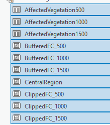

#### Reporting

- Screen capture each step of your work
- Capture the final model graph
- Capture the database with updated feature classes created from the model