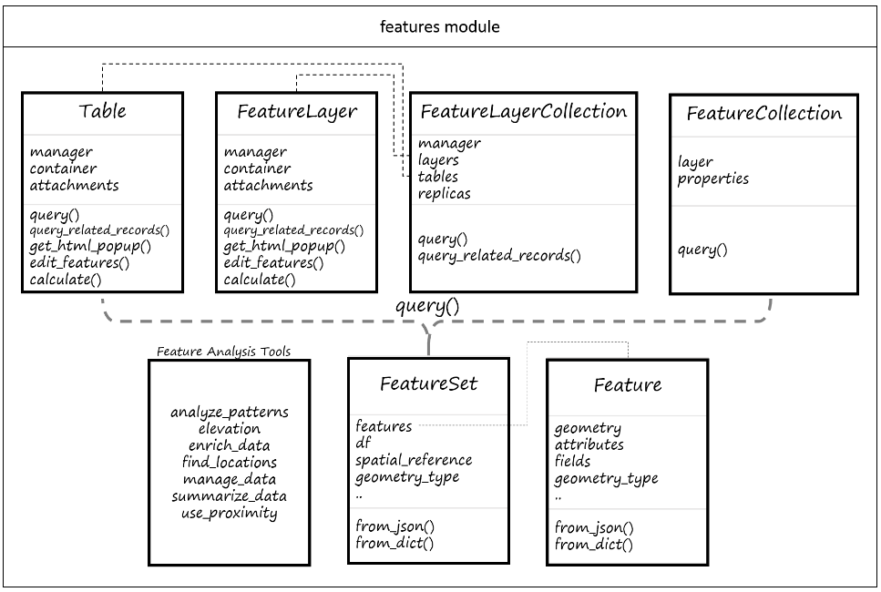
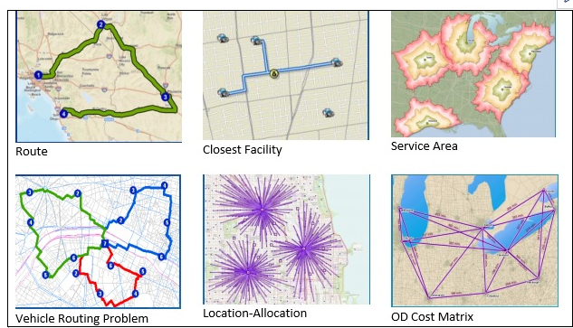

# ArcGIS API for Python

## Introduction

- The ArcGIS API for Python is a Python package for working directly with web GIS independent of ArcGIS Pro
- Functions include creating maps, geocoding, vector and raster analysis, and managing data
- In addition, the ArcGIS API for Python provides tools to manage the organization of web GIS, such as managing users, groups, and items
- To work effectively with web GIS, you need an IDE that has built-in tools for visualization. This is where Jupyter Notebook comes in

## What is ArcGIS API for Python

- The ArcGIS API for Python is implemented using the ArcGIS REST API powered by ArcGIS Online and ArcGIS Enterprise.
- he ArcGIS API for Python is not only a Python package but also an application programming interface (API)
- Representational state transfer (REST) is a style that organizes a site in a way that allows users to read URLs.
- The ArcGIS API for Python can be considered a pythonic wrapper around the ArcGIS Rest API, and both APIs work together as the interface between Python code and the web GIS portal

## Architecture of the gis module

- The `gis` module provides an information model for a GIS hosted within ArcGIS Online. 
- This module provides functionality to manage (create, read, update and delete) GIS users, groups and content. 
- This module is the most important and provides the entry point into the GIS. 

Below is a graphic of the `gis` module and its various classes:


## Installation of ArcGIS API for Python

- The ArcGIS API for Python is distributed as a Python package called arcgis.
- The arcgis package is installed as part of the arcgispro-py3 default environment of ArcGIS Pro, which makes it easy to get started using the API.
- In older versions of ArcGIS Pro, you were required to install the arcgis package using either the Python Package Manager or conda using command prompt. Staring from version 2.1, ArcGIS API for Python is installed along with the ArcPy package in the ArcGIS python enviornment.
- The API is platform agnostic, which means you can install it on Windows, Linux, or macOS operating systems
- ArcGIS API can run without ArcGIS Pro and be installed separately.
- To take full advantage of the API, however, it is beneficial to have Esri user credentials.
- To install it in Linux, for example, you can run `pip install arcgis`

## Using the arcgis module

- To start using arcgis

```python
import arcgis
```

- The following code print the arcgis version

```run-python
import arcgis
import sys
print("Python version: ", + sys.version)
print("arcgis API version:" + arcgis.__version__)
```

### the GIS class

- The GIS class is the main class in the arcgis module

```python
class arcgis.gis.GIS(url=None, username=None, password=None, 
                     key_file=None, cert_file=None, 
                     verify_cert=True, set_active=True, 
                     client_id=None, profile=None, **kwargs)
```

- The constructor uses a url and user credentials to connect to ArcGIS Online (default) or an ArcGIS enterprise portal
- Import the GIS class from the arcgis module by ```from arcgis import GIS```
- The **kwargs stands for keyworded or named arguments. The double * means the argument can have variable length of inputs. If multiple arguments are supplied, they will be passed to the functions as a  dictionary with the argument name as the key and the supplied values as values
- If no parameter is supplied, it is an anonymous login to ArcGIS online: `gis = GIS()'

### Credentials

- The GIS class have several optional arguments: URL, user name, and password
- Without credential, you have limited access to the ArcGIS Online resources
- One useful alternative is the connect using pro authentication, with ArcGIS Pro installed locally and running concurrently, known as the pro authentication scheme.

```run-python
from arcgis.gis import GIS
mygis = GIS("pro")
```

```run-python
playground_gis = GIS(url="https://pythonapi.playground.esri.com/portal", username='arcgis_python', password='amazing_arcgis_123',
                     profile='python_playground_prof')
print("profile defined for {}".format(playground_gis))
```

### Start with a map

- You can view a map in the Jupyter Notebook by defining a GIS object and the map class associated with it

```run-python
from arcgis.gis import GIS
mygis = GIS("pro")
mymap = mygis.map("Baton Rouge")
mymap
```

- To change the basemap, find the basemap list here: https://developers.arcgis.com/javascript/3/jsapi/esri.basemaps-amd.html

```pyhon
mymap.basemap = "gray-vector
mymap.basemap = "streets-vector"
# mymap.basemap = "streets-navigation-vector"
# mymap.basemap = "topo-vector"
# mymap.basemap = "gray-vector"
# mymap.basemap = "satellite"
```

### Search for contents

- To add contents to a map, you can find items from your content search function
- GIS.content will return a ContentManager object that allow users to search for contents
- the `search` function takes a query string and a content type string as input arguments

```python
from IPython.display import display
mygis = GIS()
items = mygis.content.search('NYC taxi', item_type='feature layer')
for item in items:
    display(item)
    print(item.id)
```

### The ContentManager class

- The ContentManager class is a helper class for managing content in ArcGIS Online
- Users call methods on the content object to manipulate (create, get, search, etc) items
- Methods include search, import_data, add, analyze, delete_items, etc.

### Items and item type

- An item is a unit of content in the GIS
- Each item has a unique ID and a well-known URL
- The ID is provided in the item.id property
- The server responds to a REST request with a data as html, json or pjson:
`https://www.arcgis.com/sharing/rest/content/items/64b9325940b14f3192dc148583019800?f=pjson
`
- The request returns from the server a JSON data to describe the item properties
- Items types are listed here: https://developers.arcgis.com/rest/users-groups-and-items/items-and-item-types.htm
- Web Map, Feature Serivce, Feature Collection, CSV, etc.

### Understanding JSON

- What is JSON
  - JSON standands for Javascript Object Notation
  - JSON is a lightweight data interchange format.
  - It is easy for humans to read and write. It is easy for machines to parse and generate.
- Data Structure:
   - JSON represents data as key-value pairs similar to Python dictionaries.
  - Data is stored in attribute-value pairs.
  - It supports different data types: string, number, object, array, boolean, and null.
- Key Characteristics:
  - Keys are strings, enclosed in double-quotes.
  - Values can be strings, numbers, objects, arrays, booleans, or null.
  - Objects are enclosed in curly braces {}, and arrays are enclosed in square brackets [].
  - Keys are strings, enclosed in double-quotes.
  - Values can be strings, numbers, objects, arrays, booleans, or null.
  - Objects are enclosed in curly braces {}, and arrays are enclosed in square brackets [].

```json
{
  "name": "John Doe",
  "age": 30,
  "city": "New York",
  "isStudent": false,
  "grades": [85, 90, 78],
  "address": {
    "street": "123 Main St",
    "zipCode": "10001"
  },
  "isEmployed": null
}
```

- Python extension for JSON
  - import json
  
```python
import json

# Python dictionary
person_data = {
  "name": "Bob Johnson",
  "age": 35,
  "city": "New York",
  "isStudent": True,
  "grades": [88, 95, 78],
  "address": {
    "street": "789 Maple St",
    "zipCode": "10001"
  },
  "isEmployed": False,
  "languages": ["English", "French"]
}

# Convert Python dictionary to JSON string
json_data = json.dumps(person_data, indent=2)  # indent for pretty printing

# Writing to a file
with open('person_data.json', 'w') as json_file:
    json.dump(person_data, json_file, indent=2)

print("JSON Data:")
print(json_data)
```

- Show a json content returned from the server

```python
import requests
import json

# Replace 'your_url_here' with the actual URL containing JSON data
url = 'https://services2.arcgis.com/ZQgQTuoyBrtmoGdP/arcgis/rest/services/SF_311_Incidents/FeatureServer/0?f=pjson'

try:
    # Make a GET request to the URL
    response = requests.get(url)

    # Check if the request was successful (status code 200)
    if response.status_code == 200:
        # Parse JSON data
        json_data = response.json()

        # Print the JSON data
        print(json.dumps(json_data, indent=2))  # Pretty print with an indentation of 2 spaces
    else:
        print(f"Error: Unable to fetch data. Status code: {response.status_code}")

except Exception as e:
    print(f"An error occurred: {e}")
```

### Get layers from the searched contents

- If an item found by search is a feature layer, you can use .layers to get individual layers from the item

```python
from IPython.display import display
mygis = GIS()
items = mygis.content.search('NYC taxi', item_type='feature layer')
for item in items:
    display(item)
for layer in items[0].layers:
    print(layer)
mymap = mygis.map("New York City")
mymap.basemap = "satellite"
mymap.add_layer(items[2].layers[0])
mymap

```

### Creating a content in ArcGIS Online with a JSON format

- You can create your own content on your account of ArcGIS online
- For example, you can convert a .csv file to a feature content as the JSON format
- Use import_
- Download the tree database from here:
https://data.nola.gov/Parks-Parkways/Tree-Locations/g94y-wr47

```python
from arcgis.gis import GIS
mygis = GIS("pro")
van_map = mygis.map("Vancouver, BC Canada")
import pandas as pd
df = pd.read_csv(r"C:\Users\leiwang\Downloads\Tree_locations.csv")
sample_df = df.sample(100)
sample_df['Shape'] = sample_df['Shape'].apply(lambda x: eval(x))
sample_df['Latitude'] = sample_df['Shape'].apply(lambda x: x[0])  # Extract latitude
sample_df['Longitude'] = sample_df['Shape'].apply(lambda x: x[1])  # Extract longitude

tree_df = sample_df[["TREE_ID", "COMMON", "Longitude","Latitude"]]
tree_fc = mygis.content.import_data(tree_df)
tree_fc
```

### Upload the data by converting it to GeoJSON

- GeoJSON is the extended JSON by adding a spatial component to it

```python
import json
tree_fc_dict = dict(tree_fc.properties)
trees_json = json.dumps({"featureCollection":{"layers":[tree_fc_dict]}})
tree_item_properties = {"title":"Street trees in New Orleans",
                        "description":"100 trees for testing",
                        "tags":"trees,New Orleans,csv",
                        "text":trees_json,
                        "type":"Feature Collection"}
tree_items = mygis.content.add(tree_item_properties)
tree_items.publish()

```

### Deleting a content item

- To delete an item on your GIS account, use the delete function
- Be careful when using this function, because it might remove something still useful

```python
from arcgis.gis import GIS
mygis = GIS("pro")
items = mygis.content.search("New Orleans Trees")
for itm in items:
    result = itm.delete()
    print(result)

```

### Publish the entire csv without using GeoJSON

- As GeoJSON has a limited number of records for uploading to ArcGIS, we can use the csv file directly to ArcGIS

```python
from datetime import datetime
from arcgis.gis import GIS
mygis = GIS("pro")
no_map = mygis.map("New Orleans")
no_map.basemap = "satellite"
# define the properties of the item
csv = r"C:\Users\leiwang\Downloads\Tree_locations.csv"
df = pd.read_csv(r"C:\Users\leiwang\Downloads\Tree_locations.csv")
df['Shape'] = df['Shape'].apply(lambda x: eval(x)) # Convert this shape string to a tuple and then put it back to shape as numbers (lat and long)
df['Latitude'] = df['Shape'].apply(lambda x: x[0])  # Extract latitude
df['Longitude'] = df['Shape'].apply(lambda x: x[1])  # Extract longitude
df.drop('Shape',axis = 1,inplace = True)
df.to_csv(r"C:\Users\leiwang\Downloads\Tree_locations_new.csv")
# Get the current timestamp to ensure a unique title
timestamp = datetime.now().strftime("%Y%m%d%H%M%S")
new_title = f"New Orleans Trees {timestamp}"

csv = r"C:\Users\leiwang\Downloads\Tree_locations_new.csv"
item_properties = {
    "title": new_title,
    "description": "New Orleans trees from nola.gov",
    "tags": "trees, New Orleans, urban forestry",
    "type": "CSV",
    "overwrite": True  # Set to True if you want to overwrite an existing item with the same name
}
tree_item = mygis.content.add(item_properties, data=csv)

tree_feature_layer = tree_item.publish(overwrite=True)

# Print the URL of the hosted feature layer
print("Hosted Feature Layer URL:", tree_feature_layer.url)
```

## Using the features module

- In a GIS, 'features' refer to entities located in space with a set of properties.
- Each city in a cities dataset, for example, is a feature object
- The features module also include classes "FeatureSet", "FeatureLayer", and "FeatureCollection" that allow you to represent grouping of Feature data at different levels
- The set of all point features in a layer (cities, for example) would be represetned by a "FeatureSet" object
- In WebGIS, the cities data is stored either as a web feature layer or a feature collection
- Querying the "FeatureLayer" or "FeatureCollection" objects will return "FeatureSet" objects
- The following figure shows the concepts and their relationship



### Feature, featurelayer, featureset, featurecollection

- A Feature is a entity located in space with a set of properties
`class arcgis.features.Feature(geometry=None, attributes=None`
- A FeatureLayer is where users work with features by visualizing, editing, or analyzing features
`class arcgis.features.FeatureLayer(url, gis=None, container=None, dynamic_layer=None)`
- A FeatureLayerCollection is a collection of featurelayers in an item
`class arcgis.features.FeatureLayerCollection(url, gis=None)`
- A featureset is a set of features with similar definitions of geometry and attributes
`class arcgis.features.FeatureSet(features, fields=None, has_z=False, has_m=False, geometry_type=None, spatial_reference=None, display_field_name=None, object_id_field_name=None, global_id_field_name=None)`
- A featurecollection is a featureset with a layer definition
`class arcgis.features.FeatureCollection(dictdata)`

### Searching the GIS for feature layers

- You can search the GIS for feature layer collections
- The examples below will clarify this further:

```run-python
# Establish a connection to your GIS.
from arcgis.gis import GIS
from IPython.display import display
gis = GIS() # anonymous connection to www.arcgis.com

# Search for 'USA major cities' feature layer collection
search_results = gis.content.search('title: USA Major Cities',
                                    'Feature Layer')

# Access the first Item that's returned
major_cities_item = search_results[0]

display(major_cities_item)
```

### The FeatureLayer class

- The FeatureLayer class is the primary concept for working with Feature objects in a GIS
- FeatureLayer objects can be added and visualized using maps
- They can act as inputs and outputs for feature analysis tools
- Supported functions: append, calculate, delet_features, edit_features, query, etc.
- Feature layer collection items are available as content in the GIS. You can get them using their item id, and query their layers property to get to the feature layers:

```python
freeways = gis.content.get('91c6a5f6410b4991ab0db1d7c26daacb')
freeways
```

### Understanding the url of feature layers

- The urls are made by the servers with the REST API interface
- It is called the *well-known endpoint*
- The well-known endpoint is the site root from which the rest of the API can be accessed
- It contains three components: 'host', 'context', and 'rest/serices'
- The 'host' has three parts to its structure
  - The name of the ArcGIS server (e.g. services2)
  - The domain (arcgis)
  - The top-level domain(.com)
- The 'context' component is either the name of the web adaptor configured for ArcGIS server or the site name (arcgis)
- The directory endpoint <rest/services> provide access to the site root, allowing you to see any top-level operations, services, and folders
- An example: `https://services2.arcgis.com/gdINAmBigW8mQbzB/arcgis/rest/services/AllClear_prod/FeatureServer`
- This defines a rest service called "AllClear_prod" with feature layers in it.
- Open the url in the browser can show the feature layers hosted by the service

### Accessing feature layers and tables from feature services

- A feature service serves a collection of feature layers and tables
- It is represented by `arcgis.features.FeatureLayerCollection` in the ArcGIS Python API.
- Instances of FeatureLayerCollection can be constructed using a feature service url, as shown below:


```run-python
from arcgis.features import FeatureLayerCollection
fs_url = 'https://services2.arcgis.com/ZQgQTuoyBrtmoGdP/arcgis/rest/services/SF_311_Incidents/FeatureServer'
sanfran = FeatureLayerCollection(fs_url)
sanfran.layers
```


- In the feature service directory, there is also a table:

```run-python
sanfran.tables
```
[<Table url:"https://services2.arcgis.com/ZQgQTuoyBrtmoGdP/arcgis/rest/services/SF_311_Incidents/FeatureServer/1">]

### Accessing feature layers from a feature layer url

- Instances of FeatureLayers can also be constructed using a url to the REST endpoint of a feature layer
- Use the the subscription number e.g. 0, 1, 2... to get the specific layer in the layer collection

```run-python
from arcgis.features import FeatureLayer
lyr_url = 'https://services2.arcgis.com/ZQgQTuoyBrtmoGdP/arcgis/rest/services/SF_311_Incidents/FeatureServer/0'
layer = FeatureLayer(lyr_url)
display(layer)
```

### Properties of FeatureLayer

- The `properties` field on a `FeatureLayer` object provides a dictionary representation of all its properties.
- It returns a PropertyMap object that can be printed in the dictionary format
- Access each property by the dot notation, like .extent, .fields, .geometryType, .capabilities, etc.

```run-python
feature_layer = major_cities_item.layers[0]
feature_layer.properties.extent
```

{
    "xmin": -17608123.3895845,
    "ymin": 2237818.89912024,
    "xmax": -7656889.54512499,
    "ymax": 9568526.08684907,
    "spatialReference": {
        "wkid": 102100,
        "latestWkid": 3857
    }
}

- The `capabilities` property is useful to know what kinds of edits and operations be performed on the feature layer
- The following code shows the layer supports 'Query'

```run-python
print(feature_layer.properties.capabilities)
```

- You can access the rendering information from the `drawingInfo` property

```python
feature_layer.properties.drawingInfo.renderer.type
```

'classBreaks'

### Querying feature layers

- Querying is a powerful operation that can be performed on a `FeatureLayer` object. 
- We need to know the names of fields present in the layer. This can be determined by calling the `fields` property:


```run-python
for f in feature_layer.properties.fields:
    print(f['name'])
```

- Query the data using a different spatial reference 

```run-python
query_geographic = feature_layer.query(where='POP2010 > 1000000', out_sr='4326')
print(query_geographic.features[0].geometry)
```

- Using the 'LIKE' keyword for matching patterns
- The '%' symbol is a wildcard character to represent the unrestricted part of the pattern
- The follow SQL statement will return all the states with a name starting with 'A'

```run-python
itm = mygis.content.get('85d0ca4ea1ca4b9abf0c51b9bd34de2e') #get the item USA Major Cities
feature_layer = itm.layers[0] # Get the first feature layer
fset = feature_layer.query(where="NAME LIKe 'A%'", out_sr='4326') #Query using the where clause
for ft in fset:
    print(ft.attributes['NAME'])
```

### FeatureSet properties

- A `FeatureSet` is returned by a `query()` operation.
- The `FeatureSet` object packs a bunch of useful properties that help us discern useful information about the features under access
- One of the most powerful operation on a `FeatureSet` is accessing the features not as `Feature` objects, but as pandas dataframe objects. The `sdf` property, returns a dataframe object

```python
query2 = feature_layer.query(where="POP2010 > 1000000")
query2.sdf
```

- Pandas is a population open-source python library primarily used for data manipulation and analysis
- The most powerful data structures are 'Series' and 'DataFrame'
- A 'DataFrame' is a two-dimensional, size-mutable, and potentially heterogeneous tabular data structure with labeled axes (rows and columns)

### Accessing Features from query results

- We can execute the `query()` method on the first `FeatureLayer` object and get a `FeatureSet`.
- A FeatureSet is a collection of Features and can be converted to a list if needed
- A Feature has `geometry` and `attributes`
- `geoometry` refers to a dictionary object that defines the geometry of a feature
- `attributes` refers to a dictionary object that contains the attributes about the feature

```python
query_geographic = feature_layer.query(where='POP2010 > 1000000', out_sr='4326')
query_geographic.features[0].geometry
major_cities_l1 = major_cities_item.layers[0]
major_cities_l1_fset = major_cities_l1.query(where= "FID < 11")

major_cities_l1_features = major_cities_l1_fset.features
type(major_cities_l1_features)
```

- The featureset is a list of features
- Each of the features contains geometry and other attributes presented as 

### Accessing Feature geometry and attributes

- The `Feature` object is a fine grained representation of spatial information.
- Two important properties of a `Feature` object are its `geometry` and `attributes`:

```python
major_cities_l1_features[0].geometry
major_cities_l1_features[0].attributes
```

## Visualizing data with map widget

- The `arcgis.widgets` module offers components for managing maps and scenes to visualize GIS data 
- The `GIS` object includes a map widget (of the `arcgis.widgets.MapView` class) for displaying geographic locations, visualizing GIS content, and the results of your analysis.
- To use the map widget, call `gis.map()` and assign it to a variable that you can then query to bring up the widget in the notebook.

### Creating a map widget

```python
from arcgis.gis import GIS
# Create a GIS object, as an anonymous user for this example
gis = GIS()
# Create a map widget
map1 = gis.map('Paris') # Passing a place name to the constructor
                        # will initialize the extent of the map.
map1

```

### Adding layers to the map

- The map widget can add and render web layers. 
- To add a layer, call the `add_layer()` method and pass the layer object as an argument.

```python
gis = GIS("pro")
usa_map = gis.map('USA', zoomlevel=4)  
flayer_search_result = gis.content.search("owner:esri","Feature Layer", outside_org=True)
print(flayer_search_result[1])
usa_map.add_layer(flayer_search_result[0])
usa_map
```

### Adding an Item object to the map

```python
world_timezones_item = gis.content.get('312cebfea2624e108e234220b04460b8')
usa_map.add_layer(world_timezones_item)
```

### Adding layer objects to the map

- You can add a number of different layer objects, such as `FeatureLayer`, `FeatureCollection`, `ImageryLayer`, `MapImageLayer`, to the map.

```python
world_countries_item = gis.content.get('ac80670eb213440ea5899bbf92a04998')
world_countries_layer = world_countries_item.layers[0]
world_countries_layer
usa_map.add_layer(world_countries_layer, options={'opacity':0.4})
```

### Adding a raster layer object to the map

```python
landsat_item = GIS().content.search("Landsat 8 Views", "Imagery Layer", max_items=2)[0]
landsat_item
usa_map.add_layer(landsat_item)
```

### Remove layers

```python
usa_map.remove_layers(usa_map.layers)
```

### Add a feature layer and display it with a renderer

- A renderer defines how a feature layer is drawn
- Availabe renderers are "ClassedSizeRenderer", "ClassedColorRenderer", "HeatMapRenderer", and so on.

```python
gis = GIS()
freeway_item = gis.content.search('USA Freeway System')[0]
freeway_item
freeway_sdf = freeway_item.layers[0]
freeway_fset = freeway_sdf.query(where="DIST_KM>2800", as_df=False)
freeway_fset
map5 = gis.map('USA', 10)
map5.center=[34.05,-118.2]
map5.zoom=12
map5.add_layer(freeway_fset, {'renderer':'ClassedSizeRenderer',
                              'field_name':'DIST_KM',
                              'opacity':0.75})
```

### Understanding SeDF

- We can read feature layers into a `Spatially Enabled DataFrame (SeDF)`
- SeDF creates a simple, intuitive object to manipulate geometric and attribute data
- It is derived from the popular Pandas DataFrame by inserting a spatial component to it
- The dataframe can be read from many sources, including shapefiles, GeoJSON, and Feature Layers
- You can use ArcPy, pyshp, shapely, and fiona as the geometry engine to work with SeDF
- SeDF can be exported to ArcGIS feature clases when needed.

#### Add a Spatially-Enabled Data Frame (SeDF)

- Display an SeDF on the map

```python
census_item = gis.content.get("85d0ca4ea1ca4b9abf0c51b9bd34de2e")
census_flayer = census_item.layers[0]

# Specify a SQL query and get a sub-set of the original data as a DataFrame
census_df = census_flayer.query(where="AGE_45_54 < 450").sdf

# Visualize the top 5 records
census_df.head()
census_df.spatial.plot(map_widget= usa_map)
```

#### Reading from local files

- You can read SeDF from a shapefile or geodatabase feature class
  
```python
sdf = pd.DataFrame.spatial.from_featureclass(
    "path\to\your\data\census_example\cities.shp")

sdf.tail()
```

#### Saving to a feature class

```python
sdf.spatial.to_featureclass(location=r"c:\output_examples\census.shp")

```


## Use ArcGIS Online API to perform analysis

- Many tasks can be performed using the ArcGIS API for Python on the server
- Examples like geocoding, image analysis, and network analysis
- Modules include arcgis.raster, arcgis.network, arcgis.geoanalytics, and arcgis.features

### Module arcgis.features

- The arcgis.features module allows you to access vector data from ArcGIS Online and perform some analysis
- The modules in ArcGIS API for Python is different from arcpy
- For example, the Buffer() function in arcpy has become create_buffers() in ArcGIS API for Python "use_proximity" module
- The input_layer argument is required, and others are optional


```python
use_proximity.create_buffers(input_layer, distances=[], field=None, 
                             units='Meters', dissolve_type='None', 
                             ring_type='Disks', side_type='Full', 
                             end_type='Round', output_name=None, 
                             context=None, gis=None, estimate=False, 
                             future=False)
```

- The following example will create buffers using an online item
- Use the search function in ArcGIS to find the item id: 5d93352406744d658d9c1f43f12b560c as the input features
- The airport_buf item is not published on the contents and only for visualization at this time. 

```python
from arcgis.gis import GIS
mygis = GIS("pro")
airports = mygis.content.get("5d93352406744d658d9c1f43f12b560c")
airport_lyr = airports.layers[0]
from arcgis.features import use_proximity
airport_buf = use_proximity.create_buffers(airport_lyr,distances=[50],units="Miles")
airport_map = mygis.map("USA",zoomlevel=4)
airport_map.add_layer(airport_buf)
airport_map
```

## Advanced topic: Performing network analyses using ArcGIS Online

- `Network Analysis`, in ArcGIS API for Python, is designed to help users answer questions like the following:

  - What is the quickest way to get from Manhattan to Brooklyn?
  - If a fire incident is reported in downtown San Fransisco, what are the closest fire stations that can respond to the incident within five minutes' drive time?
  - What are the market areas covered by the warehouses in various cities?
  - What is the nearest coffee shop from my current location?
  - How can we route our fleet of delivery vehicles to minimize overall transportation costs and improve customer service?
  - Where should we open a new branch of our business to maximize market share?
  - Our company needs to downsize—which stores should we close to maintain the most overall demand?
  - What are live or historical traffic conditions like, and how do they affect my network analysis results?

- The types of network analyses include route, closest facility, service area, vehicle routing, location-allocation, and OD cost matrix



### Network Analysis Services

- Network Analysis (NA) services are called by the ArcGIS Network Analysis solvers (e.g. route, closest facility, service area, location-allocation, origin-destination cost matrix, and the vehicle routing problem).
- The solver references a high-quality, worldwide network datasets stored in the ArcGIS Online cloud and will use ArcGIS Online credits.
- If you're using your own data, no online credits are used, but you need to associate your network datasets with the project.
- To access these services, you need an ArcGIS organizational account with the network analysis privilege, and the application must be connected to ArcGIS Online.
- These services consume credits when they are run.

### Find route

- Run this [notebook](../examples/part2_find_routes.ipynb)
- Explain this code in the notebook

```python
re_ordered_stops_cities = list(map(lambda x: x.attributes['NAME'], re_ordered_stops_cities_fset))
print(re_ordered_stops_cities)
```

### lambda function

- A lambda function is a small anonymous function
- It can take any number of arguments, but can only have one expression
- Syntax: ```lambda arguments: expression```

Example:
This will add 10 to argument a and return the result

```python
x = lambda a: a + 10
print(x(5))
```

This will multiply a and b in the argument

```python
x = lambda a, b: a * b
print(x(5,6))
```

### Python map() function

- the map() function returns a map object of the result after applyging the given function to each item of the given iterable (tuple, list, ect)
- Syntax ```map(fun, iter)```
  
For example, this code will return a list of the result from the function twice

```python
def twice(n):
    return n + n
 
# We double all numbers using map()
numbers = (1, 2, 3, 4)
result = map(twice, numbers)
print(list(result))
# Use the lambda function
result = list(map(lambda x: x + x,numbers))
```
