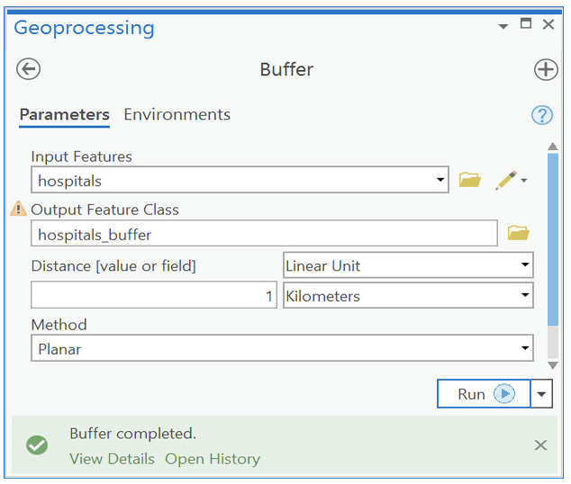
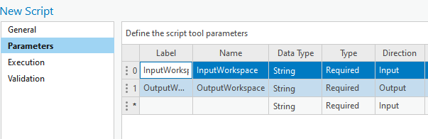
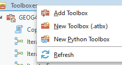

-# Geoprocessing with ArcPy

## Introduction

- ArcPy was introduced in version 10 of ArcGIS Desktop (ArcMap)
- ArcPy is a *package* including many modules. 
- Prior to ArcPy, the major scripting package is "arcgisscripting". (Still supported, but not recommended)
- To use ArcPy, simply use ```import arcpy```

## importing arcpy

- Check the environment if there is a package called arcpy
- You can use conda list to find arcpy in the package list
- To add the environment of arcgispro-py3 to anaconda environment list


```python
conda config --append envs_dirs "C:\Program Files\ArcGIS\Pro\bin\Python\envs"
```

- To clone the environment


```conda
conda create --name arcpy_clone --clone "C:\Program Files\ArcGIS\Pro\bin\Python\envs\arcgispro-py3"
```

- import error will occur if there is no arcpy available:

```message
ImportError: No module named arcpy
```

- arcpy always needs a valid ArcGIS Pro license. If not, the error message will show:

```message
RuntimeError: NotInitialized

```

- If ArcPy is installed and licensed, any external IDLE can use it, for example, in VS Code

## ArcPy modules

- In ArcPy, functionality is organized into modules
>Charts module (arcpy.charts)
Data Access module (arcpy.da)
Geocoding module (arcpy.geocoding)
Image Analysis module (arcpy.ia)
Mapping module (arcpy.mp)
Metadata module (arcpy.metadata)
Network Analyst modules (arcpy.nax and arcpy.na)
Sharing module (arcpy.sharing)
Spatial Analyst module (arcpy.sa)
Workflow Manager (Classic) module (arcpy.wmx)

- To use a module in ArcPy, just use the format of

``` ArcPy.Module```
- Use ```print(dir(ArcPy))``` to see a list of modules and classes in the package
## Setting up a workspace

- A *workspace* is a default location for files you work with in the python session. 
- Inputs and outputs of geoprocessing tools use the workspace for file access
- To set the current workspace to <q>c:\data </q>

```python
import arcpy
arcpy.env.workspace = "c:/data"

```

- Note that use the forward slash / in the path name
- If you really want to use backslash, use double backslashes. Or use the raw string operator: <q> r"c:\data"</q>
- To check the current workspace name, use print(arcpy.env.workspace)
- Check your knowledge of python classes:
  - env is the class name for environment
  - Workspace is one property of class env
  - By running the statement "arcpy.env.workspace = "c:/data", you set the property "workspace" of "env" python object to "c:/data"
  - 

## Using Geoprocessing tools

- Geoprocessing tools are accessed through their names
  >For example: addField
- *Toolbox alias*: 
  - One Geoprocessing tool could exist in multiple modules
  - Clip tool are avaiable from management, analysis, etc.
  - The Clip tool in the Analysis toolbox is referenced as Clip_analysis()
  - The Clip tool in the data management toolbox is rferenced as Clip_management()
- The syntax to call a function is ArcPy is:
  >arcpy.<toolname_toolboxalias>(<parameters>)
- An alternative way to call a function is through its module name
    > arcpy.<toolboxalias>.<toolname>(<parameters>)
    
    > For example: arcpy.analysis.Clip()

## Issues in writing python code for geoprocessing

- Python code is case sensitive
  - Therefore, clip is not correct and should be Clip
  - Tool alias names are alway in small case and function names always start with the first upper case letter.
  - Quotation marks are different in python editor than in the Word processors
    - Use straight quotation marks in python "" 
    - Use curly quotation marks in Word (hold alt and type 0145 and 0146)
    - Be careful when copying codes from pdf or word files

## Understanding the python syntax documents in ArcGIS

  ### Tool arguments (parameters)
- Name
- Type: feature class, integer, string, or raster
- Direction: input or output
- Required: whether a value must be provided or it is optional
  - Required argument come first
  - Optional argument are in parenthese {}
```
Buffer(in_features, out_feature_class, 
       buffer_distance_or_field, {line_side}, 
       {line_end_type}, {dissolve_option}, {dissolve_field})
```
### Skipping some optional argument
- For example, you want to specify the dissolve field paramete but not  other optional argument
- Use empty string, the number sign ("#"), or the value None for the skipped argument
```
arcpy.Buffer_analysis("roads", "buffer", "100 METERS", "", "", 
                      "LIST", "CODE")
arcpy.Buffer_analysis("roads", "buffer", "100 METERS", "#", "#", 
                      "LIST", "CODE")
arcpy.Buffer_analysis("roads", "buffer", "100 METERS", None, None, 
                      "LIST", "CODE")
```

### Python argument types
- non-default vs. default arguments: 
  - a default argument is defined in the function with a default value assignment
  - the default value is used if the caller does not provide one
  - None-default arguments must be provided by the caller
  - Non-default arguments must be specified before the default arguments

```
def divide_two(a, b = 1):
    return a / b
print(divide_two(3))
print(divide_two(3,2))
```
- positional vs. keyword arguments
  - Positional arguments are specified by their order
  - keyword arguments can stand by their own without following the order
```
print(divide_two(5,2))
print(divide_two(b = 2, a = 5))
```
- Use keyword arguments to specify the values of default parameters without following the order
```
arcpy.Buffer_analysis("roads", "buffer", "100 METERS", 
                      dissolve_option="LIST", dissolve_field="CODE")
```

### None value

- None is a specific built-in type in python - NoneType
- None means a null value or no value at all
- None represent the none object
- It is not the same as an empty string "" because "" is a string object

### Use parameters from user input

- Hard coded parameters only work for a specific case
- To make your code reusable, change the hard-coded parameters to variables
- use arcpy.GetParameterAsText() function to obtain user input

### Use variables
- Variable names can consist of any combination of valid characters
- Using naming styles is recommended. 
- For example, use only lower-case characters and combine words with underscores
- my_clip, clip_result, messge_out, output_file, etc.

### Work with toolboxes

- In ArcPy, all system toolboxes are available
- If you have a custom tool and want to call it from python, you can use the function arcpy.ImportToolbox()
- Once the tool is imported, you can use arcpy.toolname_toolboxalias to call the tool 
- Note that the alias is not the same as the name of the toolbox
- A new toolbox will be assigned by the system with a default alias (e.g. NewToolbox)
- It is a good practice to define a custom toolbox alias together with the tool name and label
- You can also set a temporary alias when importing a toolbox
```
arcpy.ImportToolbox("Sampletools.tbx", "mytools")
arcpy.MyMode_mytools(<parameters>)
```
### ArcPy non-tool functions

- All geoprocessing tools are functions of ArcPy, but not all functions of ArcPy are geoprocessing tools
- The non-tool functions are built-in functions in ArcPy, and do not depend on the level of license
- Non-tool functions do not have module alias names like geoprocessing tools
- Non-tool functions are documented only under the ArcPy tab of the ArcGIS Pro help pages

```
import arcpy
print(arcpy.Exists("C:/Data.streams.shp"))
```

## Work with tool output messages
### Access the tool messages

- Tools' output messages are written about the success or failure of execution.
- User can read the message and understand the result of geoprocessing
- In geoprocessing tools, the message can be viewed by clicking the View Details link at the bottom of the tool dialog box
- 

- Messages also can be accessed in the History pane
- Use arcpy.GetMessages() function to display the messages in python

### Severity level of messages
- Severity = 0: there is no problem with the tool run. 
- severity = 1: warning messages indicate a possible problem. Warning messages do not stop the tool from running
- severity = 2: error messages indicate a situation prevents the tool from execution
- A six-digit ID code is provided with the messages. Using the ID can help in identifying the causes of potential problems and how to deal with them. 
- Use arcpy.GetMaxSeverity() to get the severity level

## Work with licences

### Licence levels
- ArcView (Basic) 
- ArcEditor (Standard)
- ArcInfo (Advanced)
### License types
- Single use
- Concurrent

```
arcpy.CheckProduct("arcinfo")
```


### Check out extension license
- When using concurrent license, use arcpy.CheckOutExtensions() to enable the extensions on the current computer


## Work with spatial reference

### SpatialReference class
- SpatialReference class is a frequently used ArcPy class
- Properties: GCS, XYResolution, XYTolerance, domain, name, projectionName, etc.
- Methods: create, createfromFile(prj_file), loadFromString(string), setDomain, etc.
- Can be accssed from existing datasets using Describe()
```
dataset = "c:/data/landbase.gdb/Wetlands"
spatial_ref = arcpy.Describe(dataset).spatialReference
```
- SpatialReference objects can be compared to others using == or !=


### Create SpatialReference objects

- Obtained from existing datasets using Describe()
- Create from a .prj file
- Create from a well-known ID (WKID)
- Create from a projection name
- Create from a well-known text (WKT)

#### Well-known IDs
- Unique ID assigned for each coordinate system
- Two authorities: EPSG and ESRI
    - EPSG - European Petroleum Survey Group 
    - The IDs from the two authorities do not overlap. 
    - Use https://epsg.io/ to find the coordinate systems by name and their WKIDs. 
    - Some commonly used WKIDs:
    >WGS 84 GCS: WKID = EPSG: 4326
    
    >World Mercator Auxiliary Sphere: WKID = EPSG: 102100
    
    > NAD83:  WKID = EPSG:4269
    
    > North America Equidistant Conic with NAD83: WKID = ESRI:102010 
    
    > UTM zone 15N: WKID= EPSG:26915

- Use the "factorCode" property to get the WKID

#### Well-known text
- Well-known text (WKT) is a text markup language for representation of geometry and coordinate systems
- WKT strings are formatted by keywords and elements enclosed by square brackets. 
- The brackets are hierarchical 
```
wkt = "GEOGCS['GCS_WGS_1984',DATUM['D_WGS_1984',SPHEROID['WGS_1984',6378137.0,298.257223563]],\
              PRIMEM['Greenwich',0.0],UNIT['Degree',0.0174532925199433]];\
              -400 -400 1000000000;-100000 10000;-100000 10000;8.98315284119522E-09;\
              0.001;0.001;IsHighPrecision"
```
### projection names
- Names of coordinate systems can be used to create a SpatialReference object

```
sr = arcpy.SpatialReference("NAD 1983 StatePlane Texas Central FIPS 
                            4203 (US Feet)")
```
- List the names of spatial references:
  - arcpy.ListSpatialReferences({wild_card}, {spatial_reference_type})

## Create a python script tool

### What is a script tool 
Creating a script tool allows you to turn your Python scripts and functionality into your own geoprocessing tools. Once created, a script tool provides many advantages
- A script tool works under the geoprocessing framework of ArcGIS Pro
- The tool can be used in the same way as other built-in tools
- You can write messages to the Geoprocessing history
- ArcPy is fully aware of the application it was called from and applies the settings to the script tool

### How to create a script tool

To Create a script tool in a custom toolbox, you need three things:
- A script
- A custom toolbox
- A precise definition of the parameters of your script

### Create a script tool

- In a toolbox, right click and create -> new script
  - In General: Name the script "CopyFeatureClasses" and the same for the label
  - In parameters, add two parameters: InputWorkspace and OutputWorkspace
    - InputWorkspace: String type, Required, and Input
    - OutputWorkspace: String type, Required, and Output


  - In Execution, paste the following code
```
import arcpy
import os
from arcpy import env
env.workspace = arcpy.GetParameterAsText(0)
outgdb = arcpy.GetParameterAsText(1)
fclist = arcpy.ListFeatureClasses()
for fc in fclist:
    fcdesc = arcpy.Describe(fc)
    arcpy.CopyFeatures_management(fc,os.path.join(outgdb,fcdesc.basename))

```
- Try to run the tool from the catalog pane

## Create a Python toolbox

### What is a Python toolbox
- Python toolboxes are geoprocessing toolboxes that are created entirely in Python. 
- Python toolboxes have the file extension of .pyt
- Python toolboxes can be created under a foler in the project



### Create a Python toolbox

- In catalog pane, right click Toolboxes and select new Python toolbox
- Select a folder where the toolbox will be saved to
- Type a name for the toolbox.
- 
