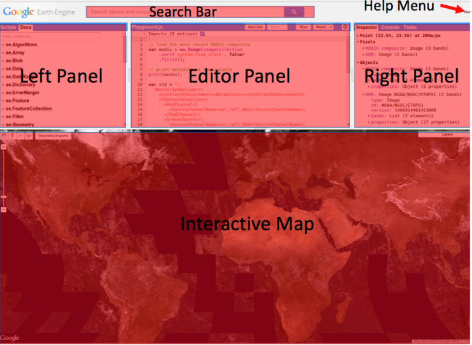

# Google Earth Engine programming

## What is Google Earth Engine (GEE)

### Definition 

- Earth Engine is a platform for scientific analysis and visualization of geospatial datasets, for academic, non-profit, business and government users.
- Earth Engine hosts satellite imagery and stores it in a public data archive that includes historical earth images going back more than forty years. The images, ingested on a daily basis, are then made available for global-scale data mining.
- Earth Engine also provides APIs and other tools to enable online analysis of large datasets: Javascript, Python, REST.
- Trending keywords in GISciences: Big Data, Cloud computing, Python

### Why is GEE useful

- Earth Engine provides easy, web-based access to an extensive catalog of satellite imagery and other geospatial data in an analysis-ready format.
- The data catalog is paired with scalable compute power backed by Google data centers and flexible APIs that let you seamlessly implement your existing geospatial workflows. 
- This enables cutting-edge, global scale analysis and visualization.

### What are avaiable from GEE?

- Datasets: A petabyte-scale archive of publicly available remotely sensed imagery and other data. Explore the data catalog.[online catalog](https://developers.google.com/earth-engine/datasets)
- Compute power: Google’s computational infrastructure optimized for parallel processing of geospatial data. 
- APIs: APIs for JavaScript and Python ([hosted on GitHub](https://github.com/google/earthengine-api)) for making requests to the Earth Engine servers. 
- These docs focus on JavaScript; ([Get started guide for the Javascript API](https://developers.google.com/earth-engine/getstarted)). 
- For Python, see the [Python install guide](https://developers.google.com/earth-engine/python_install) and the [Python examples](https://github.com/google/earthengine-api/tree/master/python/examples) in the Earth Engine GitHub repository.
- An online code Editor: An online Integrated Development Environment (IDE) for rapid prototyping and visualization of complex spatial analyses using the Javascript API.

## Get started with GEE

Try this example:
https://colab.research.google.com/drive/1wQycCKiGJSPYLT1FH8qumNkrvZqL--b-?usp=sharing

Another example:

Script: https://colab.research.google.com/drive/1_3qG7-xj2ahQ9xTb_e2GiIB3JTQ-Yrm_?usp=sharing

Data: https://drive.google.com/file/d/19y6As5AYd8minRU9Alfx30X1M6xcPean/view?usp=sharing


### Google Colab

- Colab is a part of Google Research Program
- Colab is based on Jupyter notebook and hosted by Google
- Notebooks are stored on Google drive. Google provides virtual machines of python environment
Example: https://colab.research.google.com/drive/1wJDlvzdCzfASrQduButnHBPj8hPJEHsw

### Google Code Editor

- This [code editor](https://code.earthengine.google.com) is the integrated development environment provided by Google for Javascripting
- Javascripts look very similar to Python and is also object-oriented programming langauge.
- Copy and paste the following code to the code editor and run it. 

```javascript
var l8 = ee.ImageCollection('LANDSAT/LC08/C01/T1');
var composite = ee.Algorithms.Landsat.simpleComposite({
  collection: l8.filterDate('2015-1-1', '2015-7-1'),
  asFloat: true
});
Map.setCenter(-91.17985088759607,30.450208043817256, 12);
Map.addLayer(composite, {bands: ['B6', 'B5', 'B4'], max: [0.3, 0.4, 0.3]});
```

### Javascript and Python, what are the major differences

- Varaibles are defined by the keyword var
- lines are separted by ;
- No indentation is required
- Use the curly braces {} to enclose code blocks
- Javascript uses null as the None in Python
- Javascript use // for commenting
- Javascript call it array for list in Python
- For loop: for(var i = 0; i < n; i++){code}
- Iterable: for(var elem of iterable){code}
- Function: function function_name(p1,p2,...){ }

### Javeascript code editor interface 



### Assets

- GEE allows user to upload tables or shape files for use with online maps
- The features in the shapefiles can be converted to feature collection and displayed in maps
- Assets can be shared to others through APPs or links
- Each asset will have a unique name/ID to be used in the code. For example, "users/leiwanglsu/gee"
- One can upload a shapefile as an Asset and display it in the map

### Public assets

- GEE has a collection of datasets that are called public assets
- They are open to the public and free to use
- Examples are satellite imagary, DEM, and other global datasets

## classes and functions in GEE

### class ImageCollection

#### Defintion of the class

- An ImageCollection is a fundamental data structure in Google Earth Engine.
- It represents a collection of images, where each image typically corresponds to a specific date or time and is associated with spatial information.
- Images within a collection are usually related by a common theme, such as being captured by the same sensor or covering the same geographical area.
- Images in the collection are organized along a temporal dimension, representing the time of acquisition.
- Users can filter and manipulate the collection based on temporal criteria, such as date ranges or specific time points.

#### Filtering images:

- Users can filter the ImageCollection based on various criteria, including time, location, and metadata attributes.
- This allows for the extraction of subsets of images that meet specific conditions.
- Spatial fitering: use locations and geometries to filter images
  - function: filterBounds() 
- Temporal filtering: use time to filter images
  - function: filterDate()
- Use a ee.Filter
  - filter(ee.Filter.eq('CLOUD_COVER', 0))

#### Sorting image:

- Images in the collection can be sorted 
- For example, the images are sorted by cloud cover: ```var sorted = temporalFiltered.sort('CLOUD_COVER');```
- After sorting, users can access invididual images by using first() or last(): ```var scene = sorted.first();``` 

#### first, median, mean, max, min, sum, prodcut

- These functions will reduce the collection to an image
- Use them accordingly

#### Examples of ImageCollections:

- Landsat and Sentinel satellite collections: Contain images captured by the Landsat and Sentinel satellite systems, respectively.
- MODIS (Moderate Resolution Imaging Spectroradiometer) collections: Provide daily global observations at moderate spatial resolutions.

This code will return an imageCollection object of Landsat 7, collection 1, and tier 1 collection of images
```javascript
var collection = ee.ImageCollection('LANDSAT/LE07/C01/T1')
```

Try the codes from this [page](https://developers.google.com/earth-engine/tutorials/tutorial_api_04)

### class Image

#### Definition:

- An Image is a georeferenced raster dataset that contains pixel values representing some Earth observation or measurement.
- Each pixel in the image is associated with a specific geographic location, determined by its coordinates (latitude, longitude) and a coordinate reference system.
- An image can consist of one or more bands, where each band represents a different spectral or thematic information.
  - For example, a multispectral satellite image might have bands corresponding to different wavelengths of light (e.g., red, green, blue, infrared).

#### Operations and Analysis:

- Users can perform various operations and analyses on images, including mathematical transformations, filtering, compositing, and statistical computations.
- The operations can be applied to individual bands or the entire image.

#### Visualization:

- Images can be visualized using the Google Earth Engine Code Editor or other visualization tools. 
- Visualization often involves assigning colors to different bands and displaying the result as a map.

#### Export:

- Processed images or derived information can be exported from Google Earth Engine for further analysis or external use.

#### Get an image by its ID

```ee.Image('LANDSAT/LT05/C01/T1_TOA/LT05_031034_20110619')```

- This will get an image with the unique ID of it. 
- The ID has several components: Satellite, sensor, collection, tier, path and row, date
- LANDSAT: Indicates that the image is from the Landsat satellite series. Landsat satellites capture multispectral imagery of the Earth's surface.
- LT05: Specifies the Landsat 5 satellite sensor. Each Landsat satellite has a different sensor, and Landsat 5 was equipped with the Thematic Mapper (TM) sensor.
- C01: Represents the Collection 1 level of data. Landsat Collection 1 data is a consistently processed set of data products.
- T1_TOA: Stands for Tier 1 Top of Atmosphere (TOA) reflectance. TOA reflectance values are corrected for atmospheric effects, providing a measure of the Earth's surface reflectance.
- LT05_031034: Specifies the path and row numbers of the Landsat scene. In this case, it corresponds to Landsat Path 31 and Row 34. The combination of path and row uniquely identifies a specific location on the Earth's surface.
- 20110619: Represents the acquisition date of the image in the format YYYYMMDD. In this example, the image was acquired on June 19, 2011.

#### Image.select()

- Returns an image with the selected bands.

```
print(image1.select('SR_B2').bandNames().getInfo())
print(image1.select(['SR_B7', 'SR_B5', 'SR_B3'], ['SWIR1', 'NIR', 'Green']).bandNames().getInfo())
```

#### Image.expression()

- Imnage.expression is a method to create a new image by specifying the mathematical expression to be applied to the pixel values  
- Syntax ``` var newImage = oldImage.expression(expression, {variableDictionary}```
- Example:

```javascript
// Example: Creating a new image by applying a normalized difference vegetation index (NDVI) expression
var landsatImage = ee.Image('LANDSAT/LC08/C01/T1_TOA/LC08_044034_20140318');
var ndviExpression = '(B5 - B4) / (B5 + B4)';
var ndviImage = landsatImage.expression(ndviExpression, {
  'B4': landsatImage.select('B4'), // Red band
  'B5': landsatImage.select('B5')  // Near-Infrared band
});
Map.addLayer(ndviImage)
```

- the b() function in an expression can be used to get a band from the image
```
var ndviExpression = "(b('B5') - b('B4')) / (b('B5') + b('B4'))";
var ndviImage = LandsatImage.expression(ndviExpression);
```

#### Image.NormalizedDifference()

- A common function for multi-band images to perform normalized difference equation: (b1 - b2) / (b1 + b2)
- The bands should be define. If not, the first two bands will be used

### ee.Date

- The ee.Date class is used to represent and manipulate dates and times.
- Constructing a ee.Date using an string: ```var specificDate = ee.Date('2022-01-01');```
- Or create a date with Date.now(): ```var currentDate = ee.Date(Date.now());```
- ee.Date allows to perform arithmetic operations on dates: ```var newDate = currentDate.advance(1, 'day');```
- Parsing and formatting the date to strings

```javascript
var dateString = '2022-01-01';
var parsedDate = ee.Date.parse('YYYY-MM-dd', dateString);
var formattedDate = parsedDate.format('YYYY-MM-dd');
```

### ee.Geometry

- ee.Geometry allows users to work with geometries
- Geometries include point, polygon, Rectangle, LineString, BBox
```var point = ee.Geometry.Point([-122.0838, 37.4220]);```
- Geometries can be created from GeoJSON objects

```
var geojsonObject = { "type": "Polygon", "coordinates": [ [ [-122.085,37.423],[ -122.092, 37.424],[ -122.085, 37.418], [-122.085,37.423]] ]}
var p1 = ee.Geometry(geojsonObject)
print(p1.area().getInfo())
```

- Visualization of geometries

```
var point = ee.Geometry.Point([-122.0838, 37.4220]);
Map.centerObject(point, 10); // Center the map on the point
Map.addLayer(point, {color: 'red'}, 'Point');
```

### Export

- The class is to export images or tables to user specified locations
- ee.Export.image.toDrive: Used to export an image or image collection to Google Drive.
- ee.Export.table.toDrive: Used to export a table to Google Drive.
- ee.Export.table.toAsset: Used to export a table to an Earth Engine asset.

```javascript
Export.image.toDrive({
  image: landsat,
  description: 'imageToDriveExample_transform',
  crs: projection.crs,
  crsTransform: projection.transform,
  region: geometry
});
```

## Server and client computation

- Because GEE codes run on personal computers (client) and use cloud (server) resources, some functions from clients don't mix with server functions
- Client functions such as print(), getInfo() or any method on Map, Chart, or Export may have different behaviors with server objects such as imagecollection, image, and date
- Mostly, you shall use getInfo() to extract certain properties from the ee objects

### getInfo()

Return a collection description whose fields include 
  - features: a list containing metadata about the images in the collection.
  - bands: a dictionary describing the bands of the images in this collection.
  - properties: an optional dictionary containing the collection's metadata properties.

## Visualization

### addLayer

- Map.addLayer function needs the visualization parameters visParams
- To define visParams for a multiband image, you need bands, min, and max
- ```vis = {'bands': ['B4', 'B3', 'B2'],'min': [0, 0, 0], 'max': [10000,10000, 10000]}```
- For single band visParams, you need min, max, and color progression
```
singleBandVis = { min: 0, max: 3000, palette: ['blue', 'yellow', 'green']}
```

Try this example:
```javascript
var landsatImage = ee.Image('LANDSAT/LC08/C01/T1_TOA/LC08_044034_20140318');
var ndviExpression = '(B5 - B4) / (B5 + B4)';
var ndviImage = landsatImage.expression(ndviExpression, {
  'B4': landsatImage.select('B4'), // Red band
  'B5': landsatImage.select('B5')  // Near-Infrared band
});
var vis = {min: -1, max: 1, palette:['blue','yellow','green']};
Map.addLayer(ndviImage,vis);
```

