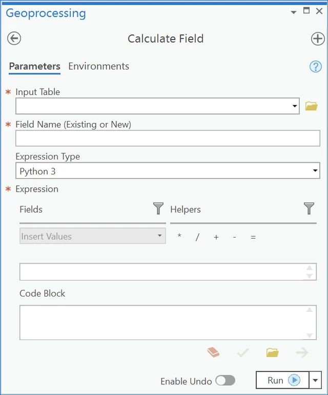

# Spatial data analysis with ArcPy

- Reference: Chapters 6, 8, 9, and 10 of Python Scripting for ArcGIS Pro

## Exploring spatial data

### Checking for the existence of data

#### *arcpy.Exists()* function

- If your input dataset does not exist, the script will return an error message and prevent the script to be executed further. 
- Using the *arcpy.Exists()* function can help the script check the problem before calling any other functions to use the data. 
- It return a boolean value of True of False
- The *Exists()* function can determine the existence of feature classes, tables, datasets, workspaces, layers, and so on

```python
import arcpy
print(arcpy.Exists("C:/Data/streams.shp"))
```

#### System path and catalog path

- System paths - recognized by the Windows system
- The existence of a system path can be determined by os.path.exists()
- Catalog paths - recognized by ArcGIS Pro
- For example, the path: "C:/data/study.gdb/final/streets" is a catalog path and cannot be understood by system path functions

#### Base name of a path

- The path name "C:/data/study.gdb/final/streets" has two components: the path name and the base name
- The base name is the feature class name
- However, it might be confusing for "C:/data/study.gdb/final". Is "final" a feature class or a feature dataset?

### *da.Walk()* function

- The *da.Walk()* fucntion is like the *os.Walk()* function built in python. 
- It will look into the subfolder structure of the workspace for all datasets in it.

```python
import arcpy
import os
walk = arcpy.da.Walk(r"C:\Users\leiwang\Documents\ArcGIS\Projects\GEOG7973\GEOG7973.gdb",datatype="FeatureClass")
for dirpath, dirnames, filenames in walk:
    for file in filenames:
        print(os.path.join(dirpath, file))ames)
```

### *Describe()* function

- There are two *Describe()* functions in ArcGIS
  - *arcpy.Describe()* returns a Describe() object
  - *arcpy.da.Describe()* returns a dictionary object

- The *Describe* object returned by *arc.Describe()* has the following properties:
>baseName, catalogPath, children, dataType, extension, file, name, path, and others.

```python
import arcpy
desc = arcpy.Describe("GWR_obesity")
print(desc.path)
```

- The da.Describe() is much more informative, as the following example code returns a dictionary object of 42 elements

```python
import arcpy
desc = arcpy.da.Describe("GWR_obesity")
print(len(desc))
```

- Use the returned dictionary by *arcpy.da.Describe()*: 

```python
print("Data type: " + desc["dataType"])
print("File path: " + desc["path"])
print("Catalog path: " + desc["catalogPath"])
print("File name: " + desc["file"])
print("Base name: " + desc["baseName"])
print("Name: " + desc["name"])
print("Spatial Reference: " + desc["spatialReference"].name)
```

- List the fields of the feature class

```python
for field in desc["fields"]:
    print("Name: {0}, type: {1}, alias: {2}".format(field.name, field.type, field.aliasName))
```

### List functions

- There are several arcpy list functions to help explore GIS data
- Try print those list functions:

```python
print([s for s in dir(arcpy) if "List" in s])
```

- The code above uses a python technique called *list comprehension*
- List comprehension uses a for loop to iterate through an iterable object and an if condition to filter out certain elements in the iterable object
- The syntax is ```[<expression> for <item> in <list> if <condition>]```
- The identified List functions in ArcPy include ListTables, ListRasters, ListFields, ListFeatureClasses, ListSpatialReferences, ListWorkspaces, etc.
- The following code use ListFields to create a list of field names:

```python
import arcpy
fc = "GWR_Obesity"
field_names = [f.name for f in arcpy.ListFields(fc)]
print(field_names)
```

## Manipulating spatial data and tables

ArcPy module arcpy.da is the data access module that work with the internal structure of vector data and tables. It helps iterate through rows of the data table by different cursors.

### Use Cursors

- A **cursor** is a database technology term for accessing records in a table.
- A cursors can be used for iterate over the records in a table or inserting new records.
- The three types of cursors: search, insert, and update
- Although there are still functional **arcpy.SearchCursor()**,  **arcpy.UpdateCursor()**, **arcpy.InsertCursor()** cursors, your code should use the cursors from the arcpy.da module as **arcpy.da.SearchCursor()** and so on.
- Syntax to use the cursors are

```python
arcpy.da.InsertCursor(in_table, field_names)
arcpy.da.SearchCursor(in_table, field_names, {where_clause}, 
                      {spatial_reference}, {explore_to_points} 
                      {sql_clause})
arcpy.da.UpdateCursor(in_table, field_names, {where_clause}, 
                      {spatial_reference}, {explore_to_points} 
                      {sql_clause})
```

### Search cursor

- The following example uses the SearchCursor to show all the records in the data by the field of *"Name" and *POP00_SQMI* and a SQL query clause of "STATE_NAME = 'Louisiana'"

```python
import arcpy
fc = "GWR_obesity"
cursor = arcpy.da.SearchCursor(fc, ["Name","POP00_SQMI"],
        where_clause='"STATE_NAME = 'Louisiana'')
for row in cursor:
    print("County: {0}, Population Density = {1}".format(row[0],row[1]))
```

- Each row element is a list of returned values. To access the values, use the index 0, 1, etc.
 
### SQL expression in Python

- The SQL expression takes the form of FieldName = value. 
- For example, STATE_NAME = 'Louisiana'
- For the field name, some versions of ArcGIS use a different format such as "Field_Name" or [Field_Name] with delimiters.
- Therefore, a function arcpy.AddFieldDelimiters() can help to ensure the correctness of the field names in the SQL expression

```python
import arcpy
fc = "GWR_obesity"
fieldname = "STATE_NAME"
delimfield = arcpy.AddFieldDelimiters(fc,fieldname) 
cursor = arcpy.da.SearchCursor(fc, ["Name","POP00_SQMI"],
        where_clause=delimfield + " = 'Louisiana'")
for row in cursor:
    print("County: {0}, Population Density = {1}".format(row[0],row[1]))
```

- In fact, the SQL expression should be "STATE_NAME" = 'Louisiana'. But it is impossible to type the double quote in a string with double quotation marks
- A solution is type \\" to get the " in the expression

```python
whereclause =  "\"STATE_NAME\" = 'Louisiana'" 
print(whereclause)
```

- An alternative is to use the triple quotes

```python
whereclause =  """"STATE_NAME" = 'Louisiana'"""
print(whereclause)
```

- Finally, if you want to use the returned values as a list, here is an example

```python
import arcpy
fc = "GWR_obesity"
fields =  ["Name","POP00_SQMI"]
whereclause =  "\"STATE_NAME\" = 'Louisiana'" 
mylist = []
with arcpy.da.SearchCursor(fc, fields,whereclause) as cursor:
    for row in cursor:
        mylist.append([row[0],row[1]])
mylist.sort()
print(mylist)
```

### Field calculator

- The Calculate Field tool is one of the tools using Python to write expressions as one of the tool parameters



- The Python 3 expression can take the form of TEXTFIELD = "Sample text"
- You can use another field as input of the expression: TEXTFIELD = !CODE!
- The exclamation marks are used to quote the field name to be referenced
- Another example is ```ACRES = !Shape_Area! / 43560```, which takes the value from shape_area, divide it by 43560, and assigned it to the field ACRES
- Python functions can be used with the referenced field values. See the following examples:

```python
TEXTFIELD = !CODE!.lower()
TEXTFIELD = !CODE![:3]
maxvalue = max([!NUM1!, !NUM2!, !NUM3!])
LOG_VALUE = math.log(!VALUE!)
```

### Calculate geometry  

- You can use the reference to !Shape! for geometry values
- SHAPE@ geometry tokens provide shortcuts to access geometry properties. 
- For example, SHAPE@XY returns a tuple of x, y coordinates that represents the feature's centroid

```python
import arcpy
fc = "GWR_obesity"
with arcpy.da.SearchCursor(fc,["SHAPE@XY"],whereclause) as cursor:
    for row in cursor:
        x, y = row[0]
        print("{}, {}".format(x, y))
```

- Geometry tokens:```type, extent, centroid, firstPoint, lastPoint, length, isMultipart, and partCount```

### Use CalculateField()

- Syntax ```CalculateField(in_table, field, expression,  expression_type}, {code_block})```

```python
import arcpy
fc = "GWR_obesity"
arcpy.AddField_management(fc, "NEWCODE", "TEXT", "", "", "20")
arcpy.CalculateField_management(fc, "NEWCODE", "!Source_ID!")
```

- You can also use the code block

```python
import arcpy
fc = "GWR_obesity"
arcpy.AddField_management(fc, "Poverty", "SHORT")
expression = "reclass(!povertyPer!)"
codeblock = """
def reclass(povertyPer):
    if (povertyPer > 10):
        return 1
    elif (povertyPer > 20):
        return 2
    else:
        return 0"""
arcpy.CalculateField_management(fc, "Poverty", expression, "", codeblock)
```

### Work with CSV

## Working with geometries


## Working with rasters