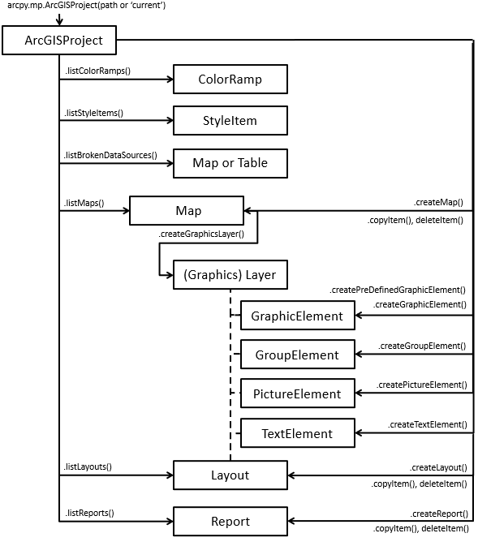

# Working with maps and layouts

- This chapter will show how to work with map and layout components using python
- The main module is from ```arcpy.mp```
- The components are the projects (.aprx) and layers (.lyr)

## The arcpy.mp module

ArcPy mapping module are as follows:

- Finding a layer with a specific data source and replacing it with another data source
- Modifying the display properties of a specific layer in multiple maps
- Generating reports that describe the contents of projects, including maps, layers, tables, and layouts
- Searching for and replacing a text string in multiple layouts in a project

### Starting from the project file

- A project in ArcGIS is stored as a .aprx file
- Using arcpy.mp, you can access the aprx file and manipulate the components
- The syntax is ```arcpy.mp.ArcGISProject(aprx_path)```

```python
aprx4057 = arcpy.mp.ArcGISProject(r"C:\Users\leiwang\Documents\ArcGIS\Projects\GEOG4057\GEOG4057.aprx")
```

- If the script is run from an ArcGIS instance, you can access the current project by using the "CURRENT" keyword in the argument

```python
aprx4057 = arcpy.mp.ArcGISProject("CURRENT")
```

### Attributes and methods of the ArcGISProject object

- To obtain a complete list of the attributes and methods, check this link: https://pro.arcgis.com/en/pro-app/latest/arcpy/mapping/arcgisproject-class.htm
- The commonly used attributes include:
  - defaultGeodatabase, databases
  - defaultToolbox
  - homeFolder
  - filePath, documentVersion, isReadOnly, dateSaved, etc
  - activeView, activewMap
- The methods include:
  - listMaps()
  - createMaps()
  - deleteItem()
  - listBasemaps()
  - listMaps()
  - listLayouts()
  - listReport()
  - listColorRamps()
  - save() and saveACopy()
  - etc.



- For example, you can use ```aprx4057.save()" to save the updates made by the script
- Note that once the project file is referenced in a script, it is locked from other applications for updating
- To remove the reference explicitely in the script, use ```del aprx4057```

### Maps

- A map in ArcGIS Pro represents a view of a collection of symbolized spatial data
- A project can have numerous maps, each containing layers, tables
- Map objects can be obtained from an ArcGISProject object by listMaps()

```python
import arcpy
aprx = arcpy.mp.ArcGISProject(r"C:\Users\leiwang\Documents\ArcGIS\Projects\GEOG4057\GEOG4057.aprx")
maps = aprx.listMaps()
for index, m in enumerate(maps):
    print(f"{index} :{m.name}")
del aprx
```

- Another way to access maps it through the Layout class's mapFrame.map property
- Each Layout may contain one more more map frames, and each map frame only contains one map

#### Properties and methods of a Map object

- Useful properties of a Map object include name, mapType, mapUnits, referenceScale, etc.
- Methods include addBasemap(), addDataFromPath(), addLayer(), addTable(), moveLayer(), removeLayer(), listLayers(), listTables(), listFeatureClasses(), etc.
- You can get a layer object from a map by listLayers()

#### Work with basemaps

- Basemaps can be added to a map by ```Map.addBaseMap()``` method
- Basemaps serve as reference maps when users added data as layers in a map
- An individual basemap can have multiple feature, raster, or web layers
- 3D basemaps are designed or local or global scenes 
- The following example code replaces the existing basemap with a different one

```python
m = arpx.listMaps()[0]
m.addBasemap("Imagery")
aprx.save()
del aprx
```

#### Add data from file as layers and remove layers

- As you can use the Add data button in ArcGIS Pro to add a dataset to the map as a layer, you can do it in Python using ```Map.addLayerFromPath()``` method

```python
m.addDataFromPath("C:/Mapping/Data.gdb/sidewalks")
aprx.save()
del aprx
```

- Remove a layer by ```Map.removeLayer(lyr)```
- The basemap is a layer in a map, and therefore you can remove the basemap by the ```Map.removeLayer()``` method

#### Add a layer from a layerfile

- Layers can be saved to files and restored as Layer objects
- To restore a Layer object from a layer file, use the LayerFile class
- The syntax is ```arcpy.mp.LayerFile(Lyf_fil_path)```
- The LayerFile class can help users deal with different layer file conditions, including group layers or multiple layers in a layer file
- To add a layer to a map, use ```Map.addLayer()``` method
- The Syntax is ```Map.addLayer(layer_or_layerfile)```
- You can use a Layer object created from another map or use the LayerFile object created from a layer file

### Layers

- A layer can be referenced from within a project using listLayers method on the Map class or from a layer file (.lyr or lyrx) on the LayerFile class
- A Layer object can access the general properties and methods of layers
- Specific layers classes such as 3DLayer, FeatureLayer, GroupLayer, RasterLayer can be defined according the layer's type
  
```python
import arcpy
aprx = arcpy.mp.ArcGISProject(r"C:\Users\leiwang\Documents\ArcGIS\Projects\GEOG4057\GEOG4057.aprx")
m = aprx.listMaps()[0]
lyrs = m.listLayers()
for lyr in lyrs:
    if lyr.isBasemapLayer:
        print(lyr.name + " is a basemap layer")
    if lyr.isFeatureLayer:
        print(lyr.name + " is a feature layer")
    if lyr.isRasterLayer:
        print(lyr.name + " is a raster layer")
del aprx
```

#### Save a layer to a layer file

- Layer objects have symbology, definition query, and other properties changed by users
- The changes can be saved to a layer file (.lyrx) on the hard disk of the computer and reused
- Use ```saveACopy()``` can save the layer to a layer file

#### Layer symbology

- The most important feature of layers is their symbology
- Users modify a layer's symbology by the Symbology class
- Once a layer is created either by adding from a data file or restored from a layer file, you can access its symbology attribute and make modification to the symbology
- The Symbology class has two properties: colorizer and renderer that are used for Raster and Vector data respectively
- Check the layer type before making changes by either colorizer (raster) or renderer (vector)
- It is also better to check if the layer supports a colorizer or renderer using the hasattr() function
- The hasattr() function is a Python builtin function to check if an object contains a certain property by a name

```python
import arcpy
aprx = arcpy.mp.ArcGISProject(r"C:\Users\leiwang\Documents\ArcGIS\Projects\GEOG4057\GEOG4057.aprx")
m = aprx.listMaps()[0]
lyrs = m.listLayers()
for lyr in lyrs:
    sym = lyr.symbology
    if lyr.isFeatureLayer:
        if hasattr(sym, "renderer"):
            print(lyr.name + ": " + sym.renderer.type)
    if lyr.isRasterLayer:
        if hasattr(sym, "colorizer"):
            print(lyr.name + ": " + sym.colorizer.type)
```

#### Apply a graduated color symbology to a Polygon feature class layer

- Polygons can be displayed as a "choropleth map" that shows polygon features in a color progression defined by intervals of polygon values
- The polygon values could be normalized by another field such as area to improve the visualization quality
- The intervals are defined by certain algorithms such as Jenk's Natural Breaks, Geometric Interval, Standard Deviation, etc.
- All these definitions of the symbology are implemented by the ```GraduatedColorsRenderer``` class
- Other renderer classes include ```SimpleRenderer```, ```GraduatedSymbolsRenderer```, ```UniqueValueRenderer```, etc.
- Use ```Symbology.updateRenderer()``` function to change the default renderer (SimpleRenderer) to GraduatedColorsRenderer. 
- The following example assumes you have a map called "State" and a Feature layer called "Counties" in the map. You run the script in the ArcGIS Project

```python
import arcpy
aprx = arcpy.mp.ArcGISProject("CURRENT")
mymap = aprx.listMaps("State")[0]
lyr = mymap.listLayers("Counties")[0]
sym = lyr.symbology
if lyr.isFeatureLayer and hasattr(sym, "renderer"):
    sym.updateRenderer("GraduatedColorsRenderer")
lyr.symbology = sym
```

- Once the renderer is changed to a GraduatedColorsRenderer, you can also modify its definition, including the field, normalizationField, classificationMethod, breakCount, and colorRamp
- The classification method can be "DefinedInterval", "EqualInterval", "GeometricalInterval", "NaturalBreaks", "Quantile", "StandardDeviation", "Manual".
  
```python
sym.renderer.classificationField = "VACANT"
sym.renderer.normalizationField = "HSE_UNITS"
sym.renderer.classificationMethod = "NaturalBreaks"
sym.renderer.breakCount = 5
sym.renderer.colorRamp = aprx.listColorRamps("Yellow-Orange-Red (5 Classes)")[0]
lyr.symbology = sym
                                      
```

#### Apply a symbology to raster layers

- Raster layers supports several colorizers: RasterClassifyColorizer, RasterUniqueValueColorizer, RasterStretchColorizer
- For categorical raster, such as Land use data, use RasterUniqueValueColorizer.
- For continuous raster, such as elevation, use RasterClassifyColorizer
- RasterClassifyColorizer works similarly to the GraduatedColorRenderer for polygon data

##### RasterStretchColorizer

- Documentation: https://pro.arcgis.com/en/pro-app/latest/arcpy/mapping/rasterstretchcolorizer-class.htm
- Properties: band, colorRamp, gamma, inverColorRamp, maxLabel, maxPercent, minLabel, minPercent, standardDeviation, stretchType, type

###### ColorRamp

- Documentation: https://pro.arcgis.com/en/pro-app/latest/arcpy/mapping/colorramp-class.htm
- Properties: name
- Obtain the ColorRamp object by project.listColorRamps("color ramp name")


```python

p =  arcpy.mp.ArcGISProject("CURRENT")
m = arp.listMaps("Map")[0]
for l in m.listLayers():
    
  if l.isRasterLayer:
    sym = l.symbology
    if hasattr(sym, 'colorizer'):
      if sym.colorizer.type == 'RasterStretchColorizer':

        #Set StretchType = PercentClip
        if l.name == "topo30m":
          sym.colorizer.stretchType = "PercentClip"
          sym.colorizer.minPercent = 1.0
          sym.colorizer.maxPercent = 1.0
          cr = p.listColorRamps('Bathymetry #2')[0]
          sym.colorizer.colorRamp = cr
          sym.colorizer.invertColorRamp = True
          sym.colorizer.gamma = 2
          sym.colorizer.minLabel = "Min: " + sym.colorizer.minLabel
          sym.colorizer.maxLabel = "Max: " + sym.colorizer.maxLabel

          l.symbology = sym
```

##### RasterUniqueColorizer

- The following example is to colorize a land use raster using the RasterUniqueValueColorizer
- It assumes your project contains a map called "Study" with a raster layer "landcover"
- The groups attribute of the colorizer returns the group of unique labels of each category in the raster

```python
aprx = arcpy.mp.ArcGISProject("CURRENT")
studymap = aprx.listMaps("Study")[0]
lyr = studymap.listLayers("landcover")[0]
sym = lyr.symbology
if sym.colorizer.type == "RasterUniqueValueColorizer":
  sym.colorizer.field = "Covertype"
  for group in sym.colorizer.groups:
        for item in group.items:
            if item.label == "Open Water":
                item.color = {'RGB': [0, 0, 255, 100]}
lyr.symbology = sym
```

### Working with layouts

- Layouts are used to produce printable maps and digital map products
- the Layout objects refer to individual single-page layouts in the project
- Layouts are identified by their ```name``` property. Therefore, it is a good practice to name layouts uniquely
- Layout elements include mapframe, legend, north arrow, title, etc.
- Use project.createLayout() to create a layout in a project

```python
p = arcpy.mp.ArcGISProject("CURRENT")
lyt = p.createLayout(8.5,11,'INCH')
```

#### The Layout class

- Properties: pageHeight, pageWidth, name, mapSeries
- Methods: listElements, exportPDF, createMapFrame, createMapSurroundElement, openView, deleteElement
- Create a map frame

```python
m = p.listMaps("Map7")[0] 
def MakeRec_LL(llx, lly, w, h):
    xyRecList = [[llx, lly], [llx, lly+h], [llx+w,lly+h], [llx+w,lly], [llx,lly]]
    array = arcpy.Array([arcpy.Point(*coords) for coords in xyRecList])
    rec = arcpy.Polygon(array)
    return rec

mf = lyt.createMapFrame(MakeRec_LL(0.5,0.5,10,7.5), m, "New Map Frame")
```

#### Adjusting map frames in a layout

- A map frame is a container for a map on the layout
- MapFrame class
  - Properties: anchor, camera, locked, longName, map, name
- A MapFrame object has a map object by ```MapFrame.map```
- The other important property of a map frame is the ```camera``` property to access a ```Camera``` object
- The Camera class
  - Properties: X, Y, Z, heading, mode, pitch, roll, scale
  - Methods: setExtent
  - For a 2D map frame, the Camera object is controlled by X, Y, and scale properties
  - Also, the extent of a map frame can be accessed by getExtent() and setExtent() functions

#### Surround elements of a map frame

- Surround elements of a map frame include legend, north arrow, scale bar elements
- The constants are "LEGEND", "NORTH_ARROW", "SCALE_BAR" [esri](https://pro.arcgis.com/en/pro-app/latest/arcpy/mapping/alphabeticallistofconstants.htm)
- `createMapSurroundElement(geometry, mapsurround_type, mapframe=None, style_item=None, name=None)`
- Layout.createMapSurroundElement(geometry, mapsurround_type, {mapframe},
    {style_item}, {name})
- For example,create a north arrow:

```python
naStyle = aprx.listStyleItems('ArcGIS 2D', 'North_Arrow', 'Compass North 1')[0]
na = lyt.createMapSurroundElement(arcpy.Point(9.5,7.5), 'North_Arrow', mf,
                                      naStyle, "Compass North Arrow")
na.elementWidth = 0.5 
```

#### Styles in a project

- In ArcGIS, styles are used to store symbols, colors, color schemes, label placements, and layout items
- Use project.listStyleItems to list the style items in your project
- The default system styles are ArcGIS 2D, ArcGID 3D, ArcGIS Colors, and ColorBrewer Schemes (RGB)
- Use Catelog to check the available styles in the project
- The style classes in each style include Point symbols, Colors, Nroth arrows, Legends, etc.

#### Exporting a layout

- Layouts can be exported to different digital formats such as tiff, bmp, eps, gif, etc.

```python
exportToAIX()
exportToBMP()
exportToEMF()
exportToEPS()
exportToGIF()
exportToJPEG()
exportToPDF()
exportToPNG()
exportToSVG()
exportToTGA()
exportToTIFF()
```
