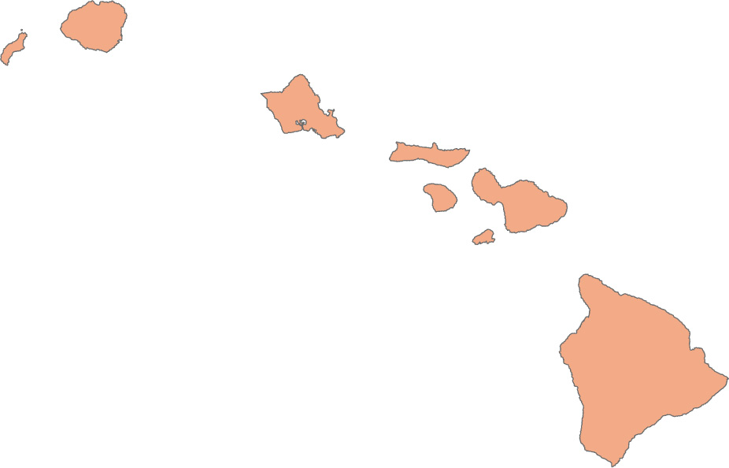

Spatial data analysis with ArcPy
===


- Reference: Chapters 6, 8, 9, and 10 of Python Scripting for ArcGIS Pro

## Exploring spatial data

### Checking for the existence of data

#### *arcpy.Exists()* function

- If your input dataset does not exist, the script will return an error message and prevent the script to be executed further.
- Using the *arcpy.Exists()* function can help the script check the problem before calling any other functions to use the data.
- It return a boolean value of True of False
- The *Exists()* function can determine the existence of feature classes, tables, datasets, workspaces, layers, and so on

```python
import arcpy
print(arcpy.Exists("C:/Data/streams.shp"))
```

#### System path and catalog path

- System paths - recognized by the Windows system
- The existence of a system path can be determined by os.path.exists()
- Catalog paths - recognized by ArcGIS Pro
- For example, the path: "C:/data/study.gdb/final/streets" is a catalog path and cannot be understood by system path functions

#### Base name of a path

- The path name "C:/data/study.gdb/final/streets" has two components: the path name and the base name
- The base name is the feature class name
- However, it might be confusing for "C:/data/study.gdb/final". Is "final" a feature class or a feature dataset?

### *da.Walk()* function

- The *da.Walk()* fucntion is like the *os.Walk()* function built in python.
- It will look into the subfolder structure of the workspace for all datasets in it.

```python
import arcpy
import os
walk = arcpy.da.Walk(r"C:\Users\leiwang\Documents\ArcGIS\Projects\GEOG7973\GEOG7973.gdb",datatype="FeatureClass")
for dirpath, dirnames, filenames in walk:
    for file in filenames:
        print(os.path.join(dirpath, file))ames)
```

### *Describe()* function

- There are two *Describe()* functions in ArcGIS
  - *arcpy.Describe()* returns a Describe() object
  - *arcpy.da.Describe()* returns a dictionary object

- The *Describe* object returned by *arc.Describe()* has the following properties:
>baseName, catalogPath, children, dataType, extension, file, name, path, and others.

```python
import arcpy
desc = arcpy.Describe("GWR_obesity")
print(desc.path)
```

- The da.Describe() is much more informative, as the following example code returns a dictionary object of 42 elements

```python
import arcpy
desc = arcpy.da.Describe("GWR_obesity")
print(len(desc))
```

- Use the returned dictionary by *arcpy.da.Describe()*: 

```python
print("Data type: " + desc["dataType"])
print("File path: " + desc["path"])
print("Catalog path: " + desc["catalogPath"])
print("File name: " + desc["file"])
print("Base name: " + desc["baseName"])
print("Name: " + desc["name"])
print("Spatial Reference: " + desc["spatialReference"].name)
```

- List the fields of the feature class

```python
for field in desc["fields"]:
    print("Name: {0}, type: {1}, alias: {2}".format(field.name, field.type, field.aliasName))
```

### List comprehension

- There are several arcpy list functions to help explore GIS data
- Try print those list functions:

```python
print([s for s in dir(arcpy) if "List" in s])
```

- The code above uses a python technique called *list comprehension*
- List comprehension uses a for loop to iterate through an iterable object and an if condition to filter out certain elements in the iterable object
- The syntax is ```[<expression> for <item> in <list> if <condition>]```
- The identified List functions in ArcPy include ListTables, ListRasters, ListFields, ListFeatureClasses, ListSpatialReferences, ListWorkspaces, etc.
- The following code use ListFields to create a list of field names:

```python
import arcpy
fc = "GWR_Obesity"
field_names = [f.name for f in arcpy.ListFields(fc)]
print(field_names)
```

## Manipulating spatial data and tables

ArcPy module arcpy.da is the data access module that work with the internal structure of vector data and tables. It helps iterate through rows of the data table by different cursors.

### Use Cursors

- A **cursor** is a database technology term for accessing records in a table.
- A cursors can be used for iterate over the records in a table or inserting new records.
- The three types of cursors: search, insert, and update
- Although there are still functional **arcpy.SearchCursor()**,  **arcpy.UpdateCursor()**, **arcpy.InsertCursor()** cursors, your code should use the cursors from the arcpy.da module as **arcpy.da.SearchCursor()** and so on.
- Syntax to use the cursors are

```python
arcpy.da.InsertCursor(in_table, field_names)
arcpy.da.SearchCursor(in_table, field_names, {where_clause}, 
                      {spatial_reference}, {explore_to_points} 
                      {sql_clause})
arcpy.da.UpdateCursor(in_table, field_names, {where_clause}, 
                      {spatial_reference}, {explore_to_points} 
                      {sql_clause})
```

### Search cursor

- The following example uses the SearchCursor to show all the records in the data by the field of *"Name" and *POP00_SQMI* and a SQL query clause of "STATE_NAME = 'Louisiana'"

```python
import arcpy
fc = "GWR_obesity"
cursor = arcpy.da.SearchCursor(fc, ["Name","POP00_SQMI"],
        where_clause='"STATE_NAME = 'Louisiana'')
for row in cursor:
    print("County: {0}, Population Density = {1}".format(row[0],row[1]))
```

- Each row element is a list of returned values. To access the values, use the index 0, 1, etc.
 
### SQL expression in Python

- The SQL expression takes the form of FieldName = value. 
- For example, STATE_NAME = 'Louisiana'
- For the field name, some versions of ArcGIS use a different format such as "Field_Name" or [Field_Name] with delimiters.
- Therefore, a function arcpy.AddFieldDelimiters() can help to ensure the correctness of the field names in the SQL expression

```python
import arcpy
fc = "GWR_obesity"
fieldname = "STATE_NAME"
delimfield = arcpy.AddFieldDelimiters(fc,fieldname) 
cursor = arcpy.da.SearchCursor(fc, ["Name","POP00_SQMI"],
        where_clause=delimfield + " = 'Louisiana'")
for row in cursor:
    print("County: {0}, Population Density = {1}".format(row[0],row[1]))
```

- In some versions of ArcGIS, the SQL expression should be "STATE_NAME" = 'Louisiana'. But it is impossible to type the double quote in a string with double quotation marks
- A solution is type \\" to get the " in the expression

```python
whereclause =  " \"STATE_NAM \" = 'Louisiana'" 
print(whereclause)
```

- An alternative is to use the triple quotes

```python
whereclause =  """"STATE_NAME" = 'Louisiana'"""
print(whereclause)
```

- Finally, if you want to use the returned values as a list, here is an example

```python
import arcpy
fc = "GWR_obesity"
fields =  ["Name","POP00_SQMI"]
whereclause =  "STATE_NAME = 'Louisiana'" 
mylist = []
with arcpy.da.SearchCursor(fc, fields,whereclause) as cursor:
    for row in cursor:
        mylist.append([row[0],row[1]])
mylist.sort()
print(mylist)
```

### Field calculator

- The Calculate Field tool is one of the tools using Python to write expressions as one of the tool parameters


- The Python 3 expression can take the form of TEXTFIELD = "Sample text"
- You can use another field as input of the expression: TEXTFIELD = !CODE!
- The exclamation marks are used to quote the field name to be referenced
- Another example is ```ACRES = !Shape_Area! / 43560```, which takes the value from shape_area, divide it by 43560, and assigned it to the field ACRES
- Python functions can be used with the referenced field values. See the following examples:

```python
TEXTFIELD = !CODE!.lower()
TEXTFIELD = !CODE![:3]
maxvalue = max([!NUM1!, !NUM2!, !NUM3!])
LOG_VALUE = math.log(!VALUE!)
```

### Calculate geometry  

- You can use the reference to !Shape! for geometry values
- SHAPE@ geometry tokens provide shortcuts to access geometry properties. 
- For example, SHAPE@XY returns a tuple of x, y coordinates that represents the feature's centroid

```python
import arcpy
fc = "GWR_obesity"
with arcpy.da.SearchCursor(fc,["SHAPE@XY"],whereclause) as cursor:
    for row in cursor:
        x, y = row[0]
        print("{}, {}".format(x, y))
```

- Geometry tokens:```type, extent, centroid, firstPoint, lastPoint, length, isMultipart, and partCount```

### Other usefual field tokens

- ArcPy provides several field tokens that allow you to access specific attributes and geometries within feature classes or feature layers in Esri's ArcGIS software. Here are some commonly used field tokens:

SHAPE@: This token is used to access the geometry of a feature, including its shape type, coordinates, and other geometry-related properties.

SHAPE@XY: As discussed earlier, this token allows you to access the X and Y coordinates of the feature's geometry.

OID@: This token represents the Object ID field, which provides a unique identifier for each feature in the feature class.

SHAPE@AREA: This token retrieves the area of the feature's geometry, which is particularly useful for polygons.

SHAPE@LENGTH: This token retrieves the length of the feature's geometry, typically used for line or polyline features.

SHAPE@WKB: This token retrieves the Well-Known Binary (WKB) representation of the feature's geometry, which is a binary format representing geometric shapes.

SHAPE@JSON: This token retrieves the geometry in JSON format, which can be useful for working with web mapping and other applications that use JSON for data exchange.


### Use CalculateField()

- Syntax ```CalculateField(in_table, field, expression,  expression_type}, {code_block})```

```python
import arcpy
fc = "GWR_obesity"
arcpy.AddField_management(fc, "NEWCODE", "TEXT", "", "", "20")
arcpy.CalculateField_management(fc, "NEWCODE", "!Source_ID!")
```

- You can also use the code block

```python
import arcpy
fc = "GWR_obesity"
arcpy.AddField_management(fc, "Poverty", "SHORT")
expression = "reclass(!povertyPer!)"
codeblock = """
def reclass(povertyPer):
    if (povertyPer > 10):
        return 1
    elif (povertyPer > 20):
        return 2
    else:
        return 0"""
arcpy.CalculateField_management(fc, "Poverty", expression, "", codeblock)
```

## Work with text file

Sometimes, data are located in text files and other tabular formats. Python has several functions to work with different formats. 

### Open a text file

```python
open(name,{mode},{buffering})
```

- The required argument is a file name. 
- If you want to open a text file to write, you need to specify the mode
  - The mode can be r (read), w (write), + (read and write), b (binary), and a (append)
  - If no mode is provided, the default value is r (read)
  - Mode can be combined. For example, if you want to read a binary file, you can use rb

### Create a new text file
```open(filename, "w")```

try the following code

```python
f = open("C:/Data/mytext.txt", "w")
f.write("Geographic Information Systems")
f.close()
```

### Use readline or readlines

```python
f = open("C:/Data/sqltext.txt")
f.read()
f = open("C:/Data/sqltext.txt")
f.readline()
```

- readlines() will return a list of text strings

### writelines()

- Use writelines to write multiple lines to a text file
- use <q> \n </q> as the line separator

#### close the file
- use close() to close the file
- If the file is not closed appropriately, it could be damaged or unavailable for other programs to use.
- However, some situations such as exceptions or error could cause the file not closed before the exception is thrown and halts the code

### Use with statement

- The logic of working with text files is: open file, read/write, close file
- You could forget to close the file and causing unexpected errors
- Use with statement, the file will be automatically closed without the need for the close() function
  
```pyton
with open(<file>) as <variable>:
    <code to process file>
```

```python
with open("C:/Data/with.txt", "w") as f:
    f.write("Use more with statements.")
```

### Use the try-finally structure

- Another approach is more robust than the with statement, which is the try-finally structure

```python
f = open("mytext.txt")
try:
    <code to process file>
finally:
    f.close()

```

- the try-finally structure will ensure the file is closed regardless what happens in the code

### Example: rewrite a text file

- You have text file with the following lines for latitute and longitude values
```
ID: 1, Latitude: 35.099722, Longitude: -106.527550
ID: 2, Latitude: 35.133015, Longitude: -106.583581
ID: 3, Latitude: 35.137142, Longitude: -106.650632
ID: 4, Latitude: 35.093650, Longitude: -106.573590
```

- The task is to rewrite the lines to the format of 

```
1 35.099722 -106.527550
2 35.133015 -106.583581
3 35.137142 -106.650632
4 35.093650 -106.573590
```

```python
with open("C:/Data/coordinates.txt") as input:
    with open("C:/Data/coordinates_clean.txt", "w") as output:
        for line in input:
            mystr = line.replace("ID: ", "")
            mystr = mystr.replace(", Latitude:", "")
            mystr = mystr.replace(", Longitude:", "")
            output.write(mystr)
```

## Work with csv files

- csv stands for comma-separated values
- A csv file is made by plain texts separated by commas
- Use the csv module to read and write csv files

### Use the csv module

```python
import csv
with open("C:/Data/csv_example.csv") as f:
    reader = csv.reader(f)
    for row in reader:
        print(row)
```

- Sometimes you want to skip the first line

```python
import csv
with open("C:/Data/csv_example.csv") as f:
    reader = csv.reader(f)
    next(reader)
    for row in reader:
        ID = row[0]
        xcoord = row[1]
        ycoord = row[2]
        print(ID, xcoord, ycoord)
```

### Geoprocessing tools that creates csv files

```python
import arcpy
arcpy.env.workspace = "C:/Data"
csvfile = "csv_example.csv"
outfc = "testpoints.shp"
arcpy.XYTableToPoint_management(csvfile, outfc, "POINT_X", "POINT_Y")
```

## Work with geometries

- Each feature in a feature class consists of vertices. 
- A vertex is a pair of x,y coordinates. 
- These vertices can be accessed using geometry objects, such as points, polylines, and polygons. 
- You can work with geometry objects and their properties by setting a cursor on the geometry field, typically named Shape, of a feature class. 
- Setting a cursor is accomplished by using a geometry token instead of a field name.
  
```python
import arcpy
fc = "C:/Data/roads.shp"
with arcpy.da.SearchCursor(fc, "SHAPE@LENGTH") as cursor
    length = 0
    for row in cursor:
        length += row[0]
        print(length)
```

### Geometry class

- The arcpy.Geometry class creates geometry objects
```
arcpy.Geometry(geometry, inputs, {spatial_reference}, {has_z}, {has_m})
```

- The type of the geometry class can be point, polyline, polygon,etc.
- The following code uses the Geometry class to calculate the total length of the roads

```python
import arcpy
fc = "C:/Data/roads.shp"
geoms = arcpy.CopyFeatures_management(fc, arcpy.Geometry())
length = 0
for geom in geoms:
    length += geom.length
print(length)
```

- The four types of geometrys are: MultiPoint, PointGeometry, Polygon, Polyline

### Point object
- A point is defined by arcpy.Point class
  
```arcpy.Point({X}, {Y}, {Z}, {M}, {ID})```

```python
point = arcpy.Point(4.900160, 52.378424)
```

- A point object is not a geometry object, but it can be used to construct a PointGeometry object

```python
point = arcpy.Point(4.900160, 52.378424)
pointgeo = arcpy.PointGeometry(point, 4326)
```
- 4326 is the factory code for the GCS with WGS84 datum (You could use "GCS_WGS_1984" instead this number)

- A point object does not have spatial reference as a PointGeometry object does

### Polyline and polygon geometry

- Polyline and Polygon geometries have more than one points
- The points are put to a list and converted to an Array class
- The array can be used to define polyline or polygon
- The following code defines a polyline with two points

```python
point1 = arcpy.Point(0, 0)
point2 = arcpy.Point(100, 100)
array = arcpy.Array([point1, point2])
polyline = arcpy.Polyline(array)
print(polyline.length)
```

- A polygon contains at least three points
- A Array with the same first and last point can create a polygon

```python
import arcpy
point1 = arcpy.Point(0,0)
point2 = arcpy.Point(100, 0)
point3 = arcpy.Point(50, 50)
array = arcpy.Array([point1, point2, point3, point1])
polygon = arcpy.Polygon(array)
print(polygon.area)
```

### Compare geometries
  
- You can compare geometry objects using the methods of geometry objects, such as crosses()

```python
import arcpy
point1a = arcpy.Point(0,0)
point1b = arcpy.Point(100, 100)
point2a = arcpy.Point(100, 0)
point2b = arcpy.Point(0, 100)
array1 = arcpy.Array([point1a, point1b])
array2 = arcpy.Array([point2a, point2b])
polyline1 = arcpy.Polyline(array1)
polyline2 = arcpy.Polyline(array2)
print(polyline1.crosses(polyline2))
```

### Read geometries from features

- Using the search cursor, the geometry field can return the geometry object from the feature
- Use a geometry token in the geometry field to retrieve geometry properties

```python
import arcpy
fc = "C:/Data/Demo.gdb/marinas"
with arcpy.da.SearchCursor(fc, ["SHAPE@XY"]) as cursor:
    for row in cursor:
        x, y = row[0]
        print("{0}, {1}".format(x,y))

```

- Polyline and polygon features returns an Array object of points
- Therefore, to read the points, you need to iterate in the Array object

```python
import arcpy
arcpy.env.workspace = "C:/Data/Demo.gdb"
fc = "pipes"
with arcpy.da.SearchCursor(fc, ["OID@", "SHAPE@"]) as cursor:
    for row in cursor:
        print("Feature {0}: ".format(row[0]))
        for point in row[1].getPart(0):
            print("{0}, {1}".format(point.X, point.Y))

```

### getPart()

- The method returns only the part of the geometry by the index value in the argument
- For a single-part feature, only the index 0 is valid
- For a multi-part feature, getPart can return other parts

### Printing with precision 

- The coordinate values often contain long decimals
- To keep only several decimal places, you can use the format code such as (0:.2f)

```python
import arcpy
arcpy.env.workspace = "C:/Data/Demo.gdb"
fc = "parcels"
with arcpy.da.SearchCursor(fc, ["OID@", "SHAPE@"]) as cursor:
    for row in cursor:
        print("Feature {0}: ".format(row[0]))
        for point in row[1].getPart(0):
            print("{0:.2f}, {1:.2f}".format(point.X, point.Y))
```

### Work with multi-part features

- Features in a feature class can have multiple parts, making them multipart features. 
- A classic example of a multipart feature is the state of Hawaii: each of the islands is its own part, but for Hawaii to be shown as a single record in the attribute table, these parts must form a single feature.



- Another example is massive lidar dataset created as multipoint feature class

#### USe isMultipart and partCount

- isMultipart can determine is the feature is multipart
- partCount returns the number of parts
- getPart returns the part by the index
- Iterate the parts in a feature

```python
import arcpy
arcpy.env.workspace = "C:/Data/Demo.gdb"
fc = "multipart_features"
with arcpy.da.SearchCursor(fc, ["OID@", "SHAPE@"]) as cursor:
    for row in cursor:
        print("Feature {0}: ".format(row[0]))
        partnum = 1
        for part in row[1]:
            print("Part {0}:".format(partnum))
            for point in part:
                print("{0}, {1}".format(point.X, point.Y))
            partnum += 1
```

### Writing geometries

- Geometries can be created using the Geometry classes
- Use InsertCursor of the arcpy.da module to create a new feature
- Use InsertRow to save the feature in the feature class
- Use CreateFeatureCLass() function to create a new feature class

```
CreateFeatureclass(out_path, out_name, {geometry_type}, {template}, 
                   {has_m}, {has_z}, {spatial_reference}, 
                   {config_keyword}, {spatial_grid_1}, 
                   {spatial_grid_2}, {spatial_grid_3})
```

- The following example creates a new feature class and write a point geometry in the feature class

```python
import arcpy
fgdb = "C:/Data/Demo.gdb"
arcpy.env.workspace = fgdb
fc = "newpoints"
arcpy.CreateFeatureclass_management(fgdb, fc, "Point", 
                                    "", "", "", 4326)
point = arcpy.Point(4.900160, 52.378424)
with arcpy.da.InsertCursor(fc, "SHAPE@") as cursor:
    cursor.insertRow([point])
```

- Alternatively, you can create a geometry class object and use CopyFeatures() to add the geometry to the feature class

```python
import arcpy
arcpy.env.workspace = "C:/Data/Demo.gdb"
point = arcpy.Point(4.900160, 52.378424)
pointgeo = arcpy.PointGeometry(point, 4326)
arcpy.CopyFeatures_management(pointgeo, "points")
```

- The following works with a polygon geometry

```python
import arcpy
fgdb = "C:/Data/Demo.gdb"
fc = "newpoly"
arcpy.env.workspace = fgdb
point = arcpy.Point()
array = arcpy.Array()
coordinates = [[3116036.11, 10071403.50],
               [3115768.36, 10071482.07],
               [3115847.82, 10071747.21],
               [3116114.23, 10071667.17]]
for coord in coordinates:
    point.X = coord[0]
    point.Y = coord[1]
    array.add(point)
polygon = arcpy.Polygon(array)
arcpy.CreateFeatureclass_management(fgdb, fc, "Polygon", 
                                    "", "", "", 2277)
with arcpy.da.InsertCursor(fc, "SHAPE@") as cursor:
    cursor.insertRow([polygon])
```

- The following example reads from a text file of coordinates and create a point feature class from it

```python
import arcpy
import fileinput
fgdb = "C:/Data/Demo.gdb"
textfile = "C:/Data/points.txt"
fc = "lake"
sr = arcpy.SpatialReference(2236)
arcpy.env.workspace = fgdb
arcpy.CreateFeatureclass_management(fgdb, fc, "Polygon", 
                                    "", "", "", sr)
with arcpy.da.InsertCursor(fc, ["SHAPE@"]) as cursor:
    array = arcpy.Array()
    point = arcpy.Point()
    for line in fileinput.input(textfile):
        point.ID, point.X, point.Y = line.split()
        array.add(point)
    polygon = arcpy.Polygon(array)
    cursor.insertRow([polygon])
    fileinput.close()

```

### Using cursors to set the spatial reference

- Your input coordinates might be in a different coordinate system from the feature class's coordinate system
- You can set the coordinate system of the insert cursor for writing the geometries to the feature class by converting from the insert cursor to the feature class
- Similarly, you can also set the coordinate system of the search cursor so that the returned geometry has a different coordinate system

```python
import arcpy
arcpy.env.workspace = "C:/Data"
mytext = "C:/Data/result.txt"
fc = "hospitals.shp"
prjfile = "C:/Projections/GCS_NAD_1983.prj"
sr = arcpy.SpatialReference(prjfile)
with arcpy.da.SearchCursor(fc, ["SHAPE@"], "", sr) as cursor:
    output = open("result.txt", "w")
    for row in cursor:
        point = row[0]
        output.write(f"{point.X} {point.Y}\n")
    output.close()
```

### Using geometry objects to work with the geoprocessing tool

- Geoprocessing tools can directly use Geometry objects 
- For example, the Buffer tool can work with some PointGeometry objects

```python
import arcpy
arcpy.env.workspace = "C:/Data"
coordlist = [[523017.4, 4260650.0],
             [523125.8, 4260732.6],
             [523084.1, 4260787.2]]
pointlist = []
sr = arcpy.SpatialReference("NAD 1983 UTM Zone 10N")
for x, y in coordlist:
    point = arcpy.Point(x,y)
    pointgeometry = arcpy.PointGeometry(point, sr)
    pointlist.append(pointgeometry)
arcpy.Buffer_analysis(pointlist, "buffer.shp", "10 METERS")

```

- Geometries can also be used as the output of geoprocessing tools

```python
import arcpy
fc = "C:/Data/roads.shp"
geolist = arcpy.CopyFeatures_management(fc, arcpy.Geometry())
length = 0
for geometry in geolist:
    length += geometry.length
print(f"Total length: {length}")
```


