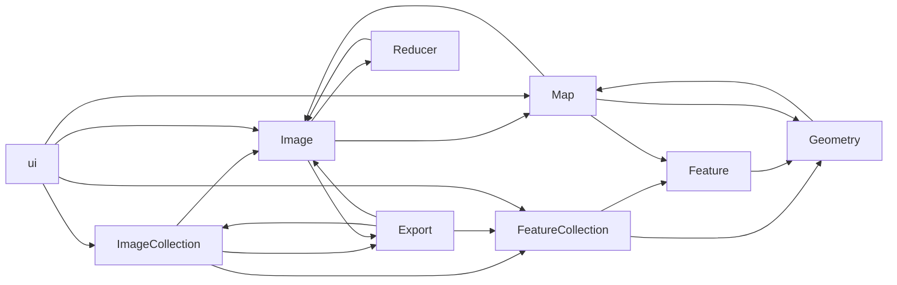

<!-- slide bg="white" -->
::: block
# Google Earth Engine programming

<!-- element style="font-size: 80px" -->
:::
<grid drag="100 6" drop="bottom">
###### GEOG 4057 GIS Programming<!-- element style="font-weight:300" -->
</grid>

---

<!-- slide template="[[tpl-con-default-box]]" -->
::: title
## What is Google Earth Engine (GEE)
:::
::: block


- Earth Engine is a platform for scientific analysis and visualization of geospatial datasets, for academic, non-profit, business and government users.
- Earth Engine hosts satellite imagery and stores it in a public data archive that includes historical earth images going back more than forty years. The images, ingested on a daily basis, are then made available for global-scale data mining.
- Earth Engine also provides APIs and other tools to enable online analysis of large datasets: JavaScript, Python, REST.
- Trending keywords in GISciences: Big Data, Cloud computing, Python

:::

---
<!-- slide template="[[tpl-con-default-box]]" -->
::: title
### Why is GEE useful
:::
::: block
- Earth Engine provides easy, web-based access to an extensive catalog of satellite imagery and other geospatial data in an analysis-ready format.
- The data catalog is paired with scalable compute power backed by Google data centers and flexible APIs that let you seamlessly implement your existing geospatial workflows. 
- This enables cutting-edge, global scale analysis and visualization.
:::
---
<!-- slide template="[[tpl-con-default-box]]" -->
::: title
### What are available from GEE?
:::
::: block
- Datasets: A petabyte-scale archive of publicly available remotely sensed imagery and other data. Explore the data catalog.[online catalog](https://developers.google.com/earth-engine/datasets)
- Compute power: Google’s computational infrastructure optimized for parallel processing of geospatial data. 
- APIs: APIs for JavaScript and Python ([hosted on GitHub](https://github.com/google/earthengine-api)) for making requests to the Earth Engine servers. 
- These docs focus on JavaScript; ([Get started guide for the Javascript API](https://developers.google.com/earth-engine/getstarted)). 
- For Python, see the [Python install guide](https://developers.google.com/earth-engine/python_install) and the [Python examples](https://github.com/google/earthengine-api/tree/master/python/examples) in the Earth Engine GitHub repository.
- An online code Editor: An online Integrated Development Environment (IDE) for rapid prototyping and visualization of complex spatial analyses using the Javascript API.

:::

---

<!-- slide template="[[tpl-con-default-box]]" -->
::: title
## Get started with GEE
:::
::: block
Try this example:
https://colab.research.google.com/drive/1wQycCKiGJSPYLT1FH8qumNkrvZqL--b-?usp=sharing

Another example:

Script: https://colab.research.google.com/drive/1_3qG7-xj2ahQ9xTb_e2GiIB3JTQ-Yrm_?usp=sharing

Data: https://drive.google.com/file/d/19y6As5AYd8minRU9Alfx30X1M6xcPean/view?usp=sharing

:::

---

<!-- slide template="[[tpl-con-default-box]]" -->
::: title
### Google Colab
:::
::: block
- Colab is a part of Google Research Program
- Colab is based on Jupyter notebook and hosted by Google
- Notebooks are stored on Google drive. Google provides virtual machines of python environment
Example: https://colab.research.google.com/drive/1wJDlvzdCzfASrQduButnHBPj8hPJEHsw
:::

---
<!-- slide template="[[tpl-con-2-1-box 50-50]]" -->
::: title
### Google Code Editor
:::
::: left
- This [code editor](https://code.earthengine.google.com) is the integrated development environment provided by Google for Javascripting
- Javascripts look very similar to Python and is also object-oriented programming langauge.
- Copy and paste the following code to the code editor and run it. 
::: 

::: right

```javascript
var l8 = ee.ImageCollection('LANDSAT/LC08/C01/T1');
var composite = ee.Algorithms.Landsat.simpleComposite({
  collection: l8.filterDate('2015-1-1', '2015-7-1'),
  asFloat: true
});
Map.setCenter(-91.17985088759607,30.450208043817256, 12);
Map.addLayer(composite, {bands: ['B6', 'B5', 'B4'], max: [0.3, 0.4, 0.3]});
```
::: 

---

<!-- slide template="[[tpl-con-default-box]]" -->
::: title
### JavaScript and Python, what are the major differences

:::
::: block

- Variables are defined by the keyword var
- lines are separated by ;
- No indentation is required
- Use the curly braces {} to enclose code blocks
- JavaScript uses null as the None in Python
- JavaScript uses // for commenting
- JavaScript calls it array for list in Python
- For loop: for(var i = 0; i < n; i++){code}
- Iterable: for(var elem of iterable){code}
- Function definition : function function_name(p1,p2,...){ }


:::

---
<!-- slide template="[[tpl-con-2-1-box 50-50]]" -->
::: title
### JavaScript code editor interface 

:::
::: left


:::
::: right
- The left Panel gives access to a list of assets, scripts, Docs, and code examples
- The center Panel is an Editor Panel for code editing and debugging
- The Right Panel shows messages of Inspector or code output, and a list of tasks running on the server
:::

---
<!-- slide template="[[tpl-con-default-box]]" -->
::: title
### Assets
:::
::: block

- GEE allows user to upload tables or shape files for use with online maps
- The features in the shapefiles can be converted to feature collection and displayed in maps
- Assets can be shared to others through APPs or links
- Each asset will have a unique name/ID to be used in the code. For example, "users/leiwanglsu/gee"
- One can upload a shapefile as an Asset and display it in the map

:::

---

<!-- slide template="[[tpl-con-default-box]]" -->
::: title
### Public assets
:::
::: block


- GEE has a collection of datasets that are called public assets
- They are open to the public and free to use
- Examples are satellite imagery, DEM, and other global datasets
:::
---
<!-- slide template="[[tpl-con-default-box]]" -->
::: title
## classes and functions in GEE

:::
::: block



:::


---
<!-- slide template="[[tpl-con-default-box]]" -->
::: title
### class `ImageCollection`
:::
::: block

- `ImageCollection` is a fundamental data structure in Google Earth Engine.
- It represents a collection of images, where each image typically corresponds to a specific date or time and is associated with spatial information.
- Images within a collection are usually related by a common theme, such as being captured by the same sensor or covering the same geographical area.
- Images in the collection are organized along a temporal dimension, representing the time of acquisition.
- Users can filter and manipulate the collection based on temporal criteria, such as date ranges or specific time points.
- Use `.getInfo()['features']` to get a list of images in the collection

:::

---

<!-- slide template="[[tpl-con-default-box]]" -->
::: title
#### Filtering ImageCollection:
:::
::: block

- Users can filter the ImageCollection based on various criteria, including time, location, and metadata attributes.
- This allows for the extraction of subsets of images that meet specific conditions.
- Because the number of images are countless in an ImageCollection, users must apply filters to reduce the number of images in the collection to a manageable range

```python
collection = ee.ImageCollection('LANDSAT/LE07/C02/T1_TOA')
    .filterDate('2002-11-01', '2002-12-01')
```
- `.filterDate()` function takes two parameters: start time and end time. 
	- If the end time parameter is not specified, a 1 million second range (about 11.5 days) will be added to the start time as the end time 
:::

---

<!-- slide template="[[tpl-con-default-box]]" -->
::: title
### `filterBounds()`
:::
::: block
- `filterBound()` function uses a ee.Geometry to define a spatial filter to find images in a collection
- The geometry can be a point, a line, or a polygon
- Construct a geometry using the following example code

```python
polygon = ee.Geometry.Polygon({
  coords: [[[-109.05, 37.0], [-102.05, 37.0], [-102.05, 41.0], // Colorado
            [-109.05, 41.0], [-111.05, 41.0], [-111.05, 42.0], // Utah
            [-114.05, 42.0], [-114.05, 37.0], [-109.05, 37.0]]],
  geodesic: false
})

# Create a Landsat 7 composite for Spring of 2000, and filter by
# the bounds of the FeatureCollection.
collection = ee.ImageCollection('LANDSAT/LE07/C02/T1')
    .filterDate('2000-04-01', '2000-07-01')
    .filterBounds(polygon)
```

:::

---


<!-- slide template="[[tpl-con-default-box]]" -->
::: title
### Using `ee.Filter`
:::
::: block
- The module `ee.Filter` contains many options to construct filters
- `ee.Filter.lt(name, value)` compare a metadata item of an image to a value

```python
ee.ImageCollection('COPERNICUS/S2')
	.filter(ee.Filter.lt('CLOUDY_PIXEL_PERCENTAGE',20))
```

- will return images in the Sentinel-2 image collection with cloud cover less than 20 percent
:::


---


<!-- slide template="[[tpl-con-default-box]]" -->
::: title
#### Sorting image:
:::
::: block

- Images in the collection can be sorted 
- For example, the images are sorted by cloud cover: 
```javascript
var sorted = temporalFiltered.sort('CLOUD_COVER');
```

- After sorting, users can access individual images by using first() or last(): 
 
```javascript
var scene = sorted.first();
```

:::

---

<!-- slide template="[[tpl-con-default-box]]" -->
::: title
#### first, median, mean, max, min, sum, product
:::
::: block
- These functions will reduce the collection to an image
- Use them accordingly
- For example, `imagecoll.first()` will return the first image in the collection
:::
---
<!-- slide template="[[tpl-con-default-box]]" -->
::: title
#### Examples of ImageCollections:
:::
::: block
- Landsat and Sentinel satellite collections: Contain images captured by the Landsat and Sentinel satellite systems, respectively.
- MODIS (Moderate Resolution Imaging Spectroradiometer) collections: Provide daily global observations at moderate spatial resolutions.
- This code will return an imageCollection object of Landsat 7, collection 1, and tier 1 collection of images

```javascript
var collection = ee.ImageCollection('LANDSAT/LE07/C01/T1')
```

Try the codes from this [page](https://developers.google.com/earth-engine/tutorials/tutorial_api_04)
:::

---
<!-- slide template="[[tpl-con-default-box]]" -->
::: title
### class `Image`
:::
::: block
- An Image is a georeferenced raster dataset that contains pixel values representing some Earth observation or measurement.
- Each pixel in the image is associated with a specific geographic location, determined by its coordinates (latitude, longitude) and a coordinate reference system.
- An image can consist of one or more bands, where each band represents a different spectral or thematic information.
  - For example, a multispectral satellite image might have bands corresponding to different wavelengths of light (e.g., red, green, blue, infrared).
:::

---
<!-- slide template="[[tpl-con-default-box]]" -->
::: title
### Create an Image object
:::
::: block
- You can get an image from an ImageCollection or directly from an URL
```run-python
import ee 
ee.Initialize()
image = ee.Image(ee.ImageCollection('LANDSAT/LC08/C02/T1_TOA')
  .filterDate('2017-01-01', '2017-12-31')
  .filterBounds(ee.Geometry.Point(-122.0808, 37.3947))
  .sort('CLOUD_COVER')
  .first())
```


```run-python
import ee
ee.Initialize()
img = ee.Image('LANDSAT/LT05/C02/T1_TOA/LT05_031034_20110619')
print(img.getInfo())
```

:::

---

<!-- slide template="[[tpl-con-default-box]]" -->
::: title
### Get image properties
:::
::: block
- Image contains properties such as unique id, number of bands, spatial extent, etc.
- Use `.getInfo()['properties']` to read the properties of the image
- Use `.getInfo()['id']` to get the unique ID of the image
- Use `.getInfo()['bands']` to get a list of bands
- For example, the following code will read from the image's system:footprint and compute its x and y range

```python
gjson = img.getInfo()['properties']['system:footprint']
coords = gjson['coordinates']

# Calculate the extreme values
x_min = min(coords)
x_max = max(coords)
y_min = min(coords)
y_max = max(coords)
```
:::

---

<!-- slide template="[[tpl-con-default-box]]" -->
::: title
#### Operations and Analysis:
:::
::: block
- Users can perform various operations and analyses on images, including mathematical transformations, filtering, compositing, and statistical computations.
- The operations can be applied to individual bands or the entire image.

```python
img = ee.Image('MODIS/006/MOD09GA/2012_03_09')
#Use the normalizedDifference(A, B) to compute (A - B) / (A + B)
ndvi = img.normalizedDifference(['sur_refl_b02', 'sur_refl_b01'])
```
:::


---


<!-- slide template="[[tpl-con-default-box]]" -->
::: title
#### Get an image by its ID
:::
::: block
```ee.Image('LANDSAT/LT05/C01/T1_TOA/LT05_031034_20110619')```

- The ID has several components: Satellite, sensor, collection, tier, path and row, date
- `LANDSAT` Indicates that the image is from the Landsat satellite series. Landsat satellites capture multispectral imagery of the Earth's surface.
	- LT05: Specifies the Landsat 5 satellite sensor. Each Landsat satellite has a different sensor, and Landsat 5 was equipped with the Thematic Mapper (TM) sensor.
- `C01` Represents the Collection 1 level of data. Landsat Collection 1 data is a consistently processed set of data products.
- `T1_TOA` Stands for Tier 1 Top of Atmosphere (TOA) reflectance. TOA reflectance values are corrected for atmospheric effects, providing a measure of the Earth's surface reflectance.
- `LT05_031034` Specifies the path and row numbers of the Landsat scene. In this case, it corresponds to Landsat Path 31 and Row 34. The combination of path and row uniquely identifies a specific location on the Earth's surface.
- `20110619` Represents the acquisition date of the image in the format YYYYMMDD. In this example, the image was acquired on June 19, 2011.
::: 

---
<!-- slide template="[[tpl-con-default-box]]" -->
::: title
#### `Image.select()`
:::
::: block
- Returns an image with the selected bands.

```javascript
print(image1.select('SR_B2').bandNames().getInfo())
print(image1.select(['SR_B7', 'SR_B5', 'SR_B3'], ['SWIR1', 'NIR', 'Green']).bandNames().getInfo())
```

- SR_B2 is the band name defined by the ImageCollection for the second band of the image. SR means "Surface Reflectance"
- getInfo() retrieves information from the server about the object

::: 
---

<!-- slide template="[[tpl-con-default-box]]" -->
::: title
#### `Image.expression()`
:::
::: block
- Imnage.expression is a method to create a new image by specifying the mathematical expression to be applied to the pixel values  
- Syntax ``` var newImage = oldImage.expression(expression, {variableDictionary}```
- Example:

```javascript
// Example: Creating a new image by applying a normalized difference vegetation index (NDVI) expression
var landsatImage = ee.Image('LANDSAT/LC08/C01/T1_TOA/LC08_044034_20140318');
var ndviExpression = '(B5 - B4) / (B5 + B4)';
var ndviImage = landsatImage.expression(ndviExpression, {
  'B4': landsatImage.select('B4'), // Red band
  'B5': landsatImage.select('B5')  // Near-Infrared band
});
Map.addLayer(ndviImage)
```

- the b() function in an expression can be used to get a band from the image

```javascript
var ndviExpression = "(b('B5') - b('B4')) / (b('B5') + b('B4'))";
var ndviImage = LandsatImage.expression(ndviExpression);
```
::: 

---

<!-- slide template="[[tpl-con-default-box]]" -->
::: title
#### `Image.NormalizedDifference()`
:::
::: block
- A common function for multi-band images to perform normalized difference equation: (b1 - b2) / (b1 + b2)
- The bands should be define. If not, the first two bands will be used
`var ndviImage = LandsatImage.NormalizedDifference();`
::: 

---

<!-- slide template="[[tpl-con-default-box]]" -->
::: title
### `ee.Date`
:::
::: block
- The ee.Date class is used to represent and manipulate dates and times.
- Constructing a ee.Date using an string: ```var specificDate = ee.Date('2022-01-01');```
- Or create a date with Date.now(): ```var currentDate = ee.Date(Date.now());```
- ee.Date allows to perform arithmetic operations on dates: ```var newDate = currentDate.advance(1, 'day');```
- Parsing and formatting the date to strings

```javascript
var dateString = '2022-01-01';
var parsedDate = ee.Date.parse('YYYY-MM-dd', dateString);
var formattedDate = parsedDate.format('YYYY-MM-dd');
```

::: 

---

<!-- slide template="[[tpl-con-default-box]]" -->
::: title
### `ee.Geometry`
:::
::: block
- ee.Geometry allows users to work with geometries
- Geometries include point, polygon, Rectangle, LineString, BBox
```var point = ee.Geometry.Point([-122.0838, 37.4220]);```
- Geometries can be created from GeoJSON objects

```javascript
var geojsonObject = { "type": "Polygon", "coordinates": [ [ [-122.085,37.423],[ -122.092, 37.424],[ -122.085, 37.418], [-122.085,37.423]] ]}
var p1 = ee.Geometry(geojsonObject)
print(p1.area().getInfo())
```

- Visualization of geometries

```javascript
var point = ee.Geometry.Point([-122.0838, 37.4220]);
Map.centerObject(point, 10); // Center the map on the point
Map.addLayer(point, {color: 'red'}, 'Point');
```

::: 

---

<!-- slide template="[[tpl-con-default-box]]" -->
::: title
### Export
:::
::: block
- The class is to export images or tables to user specified locations
- ee.Export.image.toDrive: Used to export an image or image collection to Google Drive.
- ee.Export.table.toDrive: Used to export a table to Google Drive.
- ee.Export.table.toAsset: Used to export a table to an Earth Engine asset.

```javascript
Export.image.toDrive({
  image: landsat,
  description: 'imageToDriveExample_transform',
  crs: projection.crs,
  crsTransform: projection.transform,
  region: geometry
});
```

::: 

---

<!-- slide template="[[tpl-con-default-box]]" -->
::: title
## Server and client computation
:::
::: block
- Because GEE codes run on personal computers (client) and use cloud (server) resources, some functions from clients don't mix with server functions
- Client functions such as print(), getInfo() or any method on Map, Chart, or Export may have different behaviors with server objects such as imagecollection, image, and date
- Mostly, you shall use getInfo() to extract certain properties from the ee objects
::: 


---

<!-- slide template="[[tpl-con-default-box]]" -->
::: title
### `getInfo()`
:::
::: block
- Return a collection description whose fields include 
  - features: a list containing metadata about the images in the collection.
  - bands: a dictionary describing the bands of the images in this collection.
  - properties: an optional dictionary containing the collection's metadata properties.
::: 


---

<!-- slide template="[[tpl-con-default-box]]" -->
::: title
## Visualization
:::
::: block
### `addLayer`

- Map.addLayer function needs the visualization parameters visParams
- To define visParams for a multiband image, you need bands, min, and max
- ```vis = {'bands': ['B4', 'B3', 'B2'],'min': [0, 0, 0], 'max': [10000,10000, 10000]}```
- For single band visParams, you need min, max, and color progression

```javascript
singleBandVis = { min: 0, max: 3000, palette: ['blue', 'yellow', 'green']}
```
::: 

---

<!-- slide template="[[tpl-con-default-box]]" -->
::: title

#### Try this example:
:::
::: block
```javascript
var landsatImage = ee.Image('LANDSAT/LC08/C01/T1_TOA/LC08_044034_20140318');
var ndviExpression = '(B5 - B4) / (B5 + B4)';
var ndviImage = landsatImage.expression(ndviExpression, {
  'B4': landsatImage.select('B4'), // Red band
  'B5': landsatImage.select('B5')  // Near-Infrared band
});
var vis = {min: -1, max: 1, palette:['blue','yellow','green']};
Map.addLayer(ndviImage,vis);
```
- min, max, and palette are elements of a dictionary data structure required by the visualization parameter of `.addLayer()` function

::: 

---

<!-- slide template="[[tpl-con-default-box]]" -->
::: title

#### Use Python for Gee
:::
::: block
- You can select to use Python instead of JavaScript and run code on different platforms
- Install the Python API: `pip install earthengine-api`
- After installation, use `import ee` to import the modules
- At the first time of running the module, you need to authenticate your Google account to use gee on your computer
- Use `ee.Authenticate()` to authenticate or run 
- Before running authentication, make sure your account has been registered as Google developer by going to this site: `https://code.earthengine.google.com/`

:::


---

<!-- slide template="[[tpl-con-default-box]]" -->
::: title

#### Use the map module `geemap`
:::
::: block
- Unlike the code interface of Gee in JavaScript, the Gee Python module does not provide a module to show map in Jupyter notebooks
- You can install a third-party package `geemap` to display Google data on a map

```run-python
import geemap

# Create a map centered at a specific location
Map = geemap.Map(center=[40, -100], zoom=4) 

# Add a basemap from Google Maps
Map.add_basemap('HYBRID')

# Display the map
Map
```

:::

---

<!-- slide template="[[tpl-con-default-box]]" -->
::: title

#### Example code: download an image
:::
::: block

```run-python
import ee
import ee.mapclient

ee.Initialize()

# Get a download URL for an image.
image1 = ee.Image('CGIAR/SRTM90_V4')
path = image1.getDownloadUrl({
    'scale': 30,
    'crs': 'EPSG:4326',
    'region': '[[-120, 35], [-119, 35], [-119, 34], [-120, 34]]'
})
print(path)
```

- A link will be returned from the code for downloading the image directly: [link](https://earthengine.googleapis.com/v1/projects/earthengine-legacy/thumbnails/b169f7284281b474cf924744d932a2f5-8da95e06c4a60879b877c52b0bf198cb:getPixels)
:::

---

<!-- slide template="[[tpl-con-default-box]]" -->
::: title

#### Example code: display hillshade
:::
::: block

```run-python
import math
import ee
import ee.mapclient

ee.Initialize()
ee.mapclient.centerMap(-121.767, 46.852, 11)


def Radians(img):
  return img.toFloat().multiply(math.pi).divide(180)


def Hillshade(az, ze, slope, aspect):
  """Compute hillshade for the given illumination az, el."""
  azimuth = Radians(ee.Image(az))
  zenith = Radians(ee.Image(ze))
  # Hillshade = cos(Azimuth - Aspect) * sin(Slope) * sin(Zenith) +
  #     cos(Zenith) * cos(Slope)
  return (azimuth.subtract(aspect).cos()
          .multiply(slope.sin())
          .multiply(zenith.sin())
          .add(
              zenith.cos().multiply(slope.cos())))

terrain = ee.Algorithms.Terrain(ee.Image('CGIAR/SRTM90_V4'))
slope_img = Radians(terrain.select('slope'))
aspect_img = Radians(terrain.select('aspect'))

# Add 1 hillshade at az=0, el=60.
ee.mapclient.addToMap(Hillshade(0, 60, slope_img, aspect_img))
```
:::

---
